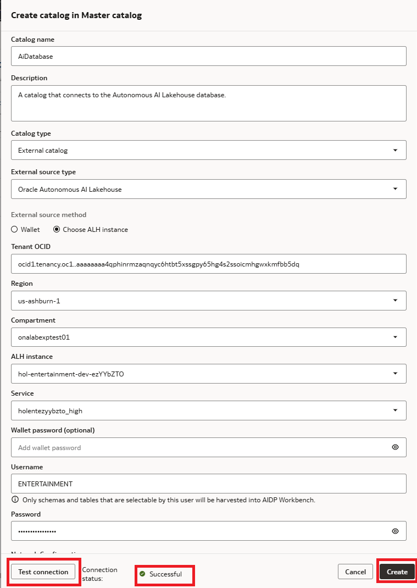

# Lab 1: Data Environment Setup

## Introduction

Before building the AI agent, we need to ensure the data environment is in place. In this lab, you'll explore the pre-configured catalog and volume that have been set up for the workshop, then create a Knowledge Base that turns those documents into vector representations for RAG retrieval. You'll also verify the Oracle AI Database tables that will power the agent's SQL tools.

By the end of this lab, all the data assets — structured (database tables) and unstructured (knowledge base documents) — will be ready for the agent flow you'll build in Lab 2.

**Estimated Time:** 15 Minutes

### Objectives

In this lab you will:

1. Create a new standard catalog (`entertainment_analyst`) and managed volume (`entertainment_analyst`) where you'll upload release playbooks and strategy documents
2. Create a Knowledge Base and an associated data source that consumes the documents from the managed volume
3. Verify the Oracle AI Database tables that contain box office, streaming, and marketing data
4. Understand how the structured (SQL) and unstructured (RAG) data assets connect to the agent you'll build

### Prerequisites

This lab assumes you have:

* Reviewed the Workshop Introduction and Overview
* Access to the AIDP Workbench instance provisioned for this workshop

## Task 1: Create the (External) Database Catalog

An external catalog in AIDP is used to connect to an Autonomous Lakehouse (ALH) database. For this workshop, you'll be creating a new external catalog.

1. From the AIDP Workbench Home Page, click on **Master Catalog**.

2. Click **[Create catalog]** in the upper right coner. Provide a catalog name **`AiDatabase`** and a description **`A catalog that connects to the Autonomous AI Lakehouse database.`**, then select **Catalog type** -> **External catalog**.

3. For **External source method** select **Choose ALH instance**.

4. Several fields should auto-populate. Move to the **ALH instance** drop down and locate the **hol-entertainment-dev-zzz** instance. The last 8 characters will be a random string.

5. From the **Service** dropdown, select the label that ends with **_high** to choose the high priority DSN.

6. Enter authentication details:

    - **Wallet password (optional)**: You may choose your own password, or leave this field blank and allow AIDP to manage the wallet password.
    - **Username**: ENTERTAINMENT
    - **Password**: This is retrieved from the ORM stack State 
    TODO: need to make it easier to retrieve this password.

7. Click **[Test connection]** - confirm that the connection is successful.

8. Click **[Create]**.

    
 
## Task 2: Create the (Standard) Entertainment Analyst Catalog

A standard catalog in AIDP stores AI-related artifacts — volumes, tables, schemas, and knowledge bases. For this workshop, you'll be creating a new standard catalog.

1. From the AIDP Workbench Home Page, click on **Master Catalog**.

2. Click **[Create catalog]** in the upper right corner. Provide a catalog name **`entertainment_analyst`** and a description **`a catalog that stores the assets needed by the entertainment industry analyst agent.`**. Click **[Create]**

    

3. It will take just a moment to create the new catalog. When ready, click **entertainment_analyst** to open the new catalog.

    > **Note**: a **Standard Catalog** means it stores data directly within AIDP (backed by OCI Object Storage and Delta Lake), as opposed to an External Catalog which connects to data outside the platform.

4. Click on the **default** schema within the catalog. This is where the volume and knowledge base assets are organized.

    

## Task 3: Create the Managed Volume

A volume stores unstructured data — files, documents, images — within a catalog. The volume for this workshop contains the internal release playbooks and strategy documents that the RAG tool will search.

1. First off, [Click Here](https://github.com/enschilling/workshop-dev/raw/refs/heads/main/ai-dataplatform-agent-flow-entertainment/files/kb_documents.zip) to download the Zip file containing all the sample docs required for this workshop.

2. Unzip the file; you should have 3 `.docx` and 3 `.txt` files pertaining to the Knowledge Base components, and 1 `agent_instructions.txt` file that you'll use in Lab 2.

    - **Content Strategy & Release Operations Playbook** — Defines release windows, territory prioritization, green/yellow/red performance signals, and decision frameworks
    - **Marketing Measurement & Attribution Guidelines** — Defines metric definitions (e.g., completion rate, ROI), attribution logic, and interpretation rules
    - **Distribution Window & Territory Rules** — Defines territorial constraints, windowing strategies, and market codes
    - **Agent Instructions** - Detailed parameters that will be used to define how the agent is to operate

3. Back in the AIDP Wrokbench, return to the **`entertainment_analyst`** catalog, locate the **default** schema, click on **Volumes**.

4. Click the **+** next to the filter field to start creating a new volume.

    

5. Provide a name for the volume **`entertainment_analyst`** and a description **`this volume stores release playbooks, market prioritization, etc.`**. Click **[Create]**.

    

6. Click the volume name **`entertainment_analyst`** then click the **+** button to the right of the Filter field. Click to browse or drag-and-drop the three `.docx` files from the Zip archive you downloaded earlier.

    

    
.7 Click **[Upload]**, then review the files. You should see the following internal documents:

4. These are the documents that the AI agent will search via RAG when users ask questions about definitions, policies, thresholds, or interpretation rules. For example, when a user asks *"What does our playbook say about territory priorities for releases?"*, the agent will retrieve relevant passages from these documents.

## Task 4: Create a Knowledge Base

Now we'll create the key asset that enables RAG. A Knowledge Base creates vector representations (embeddings) of the documents in the volume. When the agent receives a question, it performs a semantic search against these vectors to find the most relevant passages — even if the user's wording doesn't exactly match the document text.

1. Navigate back to the **`entertainment_analyst`** catalog. Click on the **default** schema.

2. Click on **Knowledge Bases**.

3. Click the **+** button to create a new Knowledge Base.

4. Enter the following values:

    ```
    Name: entertainment_analyst_kb
    Description: Contains internal release playbooks, marketing guidelines, and distribution rules
    ```

    

5. Leave the **Advanced Settings** as-is for now. These settings control the embedding model, chunk size, and chunk overlap. The defaults are appropriate for this workshop.

6. Click **Create**. The Knowledge Base will take a few seconds to become Active.

7. Once the Knowledge Base shows status **Active**, click on it to open the details.

8. Under the **Data Source** tab, click the **+** button to add a data source.

    

9. In the data source selection window, select the **`entertainment_analyst`** volume from your catalog. This is the volume containing the release strategy and playbook documents. Leave all advanced settings as-is.

10. Click **Add**.

    

11. Navigate to the **History** tab of your Knowledge Base. You should see a line entry with the operation name **"Update Knowledge Base"**. This step ingests the documents — chunking them, generating embeddings, and indexing the vectors.

    

12. Wait for the status to show **Succeeded** before moving on. This typically takes less than one minute since we're ingesting a small set of documents.

    > **What just happened?** The Knowledge Base chunked each document into smaller passages, generated vector embeddings for each chunk using an embedding model, and stored those vectors in an index. When the RAG tool receives a query, it converts the query into a vector, finds the most semantically similar chunks, and returns them as context for the LLM. This is how the agent can answer policy and definition questions grounded in your actual internal documents.

## Task 5: [Optional] Verify the Oracle AI Database Tables

The agent's SQL tools query structured data from an Oracle AI Database. For this workshop, the following tables have been pre-ingested with entertainment performance data.

1. Log into the OCI Console (See *Get Started* in left nav menu for more details).

2. Use the navigation menu to open the Autunomous AI Database console.

    

3. Click the name of the autonmous database to view details. When the page loads, click **[Database actions]** and select **SQL**.  This will open the SQL Workbench in a new brower tab.

4. In the *Navigator* on the left, click the first drop-down menu and locate the **Entertainment** schema. 

    * You should see the following tables populate below.

    | Table Name | Description | Key Columns |
    |---|---|---|
    | `titles` | Master list of all movies and TV shows | `title_id`, `title_name` |
    | `markets` | Reference table of market codes, names, and currencies | `market_code`, `market_name`, `currency` |
    | `box_office_weekend` | Weekend theatrical performance by title and market | `title_id`, `weekend_end_date`, `market_code`, `gross_usd_m`, `screens`, `rank` |
    | `streaming_weekly` | Weekly streaming metrics by title and region | `title_id`, `week_start_date`, `region_code`, `starts`, `hours_streamed_k`, `completion_rate` |
    | `marketing_campaigns` | Campaign metadata linking campaigns to titles | `campaign_id`, `campaign_name`, `title_id`, `start_date`, `end_date` |
    | `marketing_daily_spend` | Daily spend and attributed revenue by campaign and channel | `campaign_id`, `channel`, `spend_usd`, `attributed_revenue_usd` |

5. Check one or more of the tables to view the data.

    ```sql
    <copy>
    select * from ENTERTAINMENT.marketing_daily_spend;
    </copy>
    ```

    

    

6. These tables represent the **gold layer** of the medallion architecture — curated, query-optimized data ready for business consumption. The agent's SQL tools will execute parameterized, read-only queries against these tables to answer performance and ROI questions.


    > **Key takeaway**: You now have two categories of data assets ready for the agent:
    > - **Unstructured (RAG)**: The Knowledge Base with vector-indexed release playbooks and strategy documents — for answering questions about definitions, policies, and interpretation rules
    > - **Structured (SQL)**: The Oracle AI Database tables with box office, streaming, and marketing data — for answering questions about specific metrics, trends, and ROI numbers

7. You may close the SQL Workbench browser tab and return to the AI Data Platform tab for the remainder of the workshop.

## Lab 1 Recap

In this lab, you set up the complete data environment for the Entertainment Analyst agent:

- You created a new **`AiDatabase`** external catalog connecting to the Autnomous Lakehouse AI Database instance.
- You created a new **`entertainment_analyst`** standard catalog and a **`entertainment_analyst`** volume, then uploaded internal release playbooks and strategy documents.
- You created a **Knowledge Base** (`entertainment_analyst_kb`), populated it with documents from the volume, and verified that the ingestion succeeded. This enables RAG — the agent can now search your internal documents by semantic meaning.
- You verified the **Oracle AI Database tables** containing box office, streaming, and marketing campaign data. These power the agent's SQL tools.

In the next lab, you'll create the agent flow itself — configuring the AI Compute, building the agent node, and wiring up the RAG and SQL tools.

## Learn More

* [Unlock the Power of the Catalog in AIDP Workbench — Oracle Community](https://community.oracle.com/products/oracleaidp/discussion/27748/unlock-the-power-of-the-catalog-in-aidp-workbench)
* [AIDP Workbench FAQs: Collaboration, Medallion Architecture, and Data Storage — Oracle Community](https://community.oracle.com/products/oracleanalytics/discussion/28251/aidp-workbench-faqs-collaboration-medallion-architecture-and-data-storage)
* [Oracle AI Data Platform — Documentation](https://docs.oracle.com/en/cloud/paas/ai-data-platform/)
* [Oracle AI Data Platform — Sample Notebooks on GitHub](https://github.com/oracle-samples/oracle-aidp-samples)

## Acknowledgements

* **Author(s)** - Jean-Rene Gauthier [AIDP]
* **Contributors** - Eli Schilling - Cloud Architect, Gareth Nathan - SDE, GenAI
* **Last Updated By/Date** - Published March 2026
