# Lab 2: Setup the Database

## Introduction

In this lab, we are going to create an Autonomous AI Database, define the schema for PV systems and interconnection requests, and insert seed data that the Grid Operations Agent will query.

**Estimated Time:** 25 minutes

### Objectives

In this lab, you will:

- Create an Autonomous AI Database instance.
- Create the database schema.
- Insert data into the database.
- Create a vault to securely store the database connection information.
- Create a database connection.

### Prerequisites

This lab assumes you have:

- Completed the previous labs.

## Task 1: Create an Autonomous AI Database instance

In this task we are going to create a new Autonomous AI Database instance.

1. Click the navigation menu on the top left.

2. Click **Oracle Database**.

3. Click **Autonomous AI Database**.

    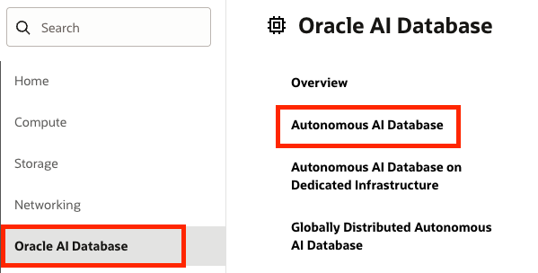

4. Under the **List scope** section, make sure that the root compartment is selected.

5. Click the **Create Autonomous AI Database** button at the top of the Autonomous AI Databases table.

    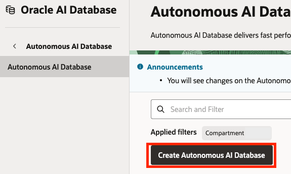

6. For the **Display name** use: `grid-interconnection`.

7. For the **Database name** use: `gridinterconnect`.

8. Under the **Compartment**, make sure that the root compartment is selected.

9. Under **Workload type** make sure that **Lakehouse** is selected.

    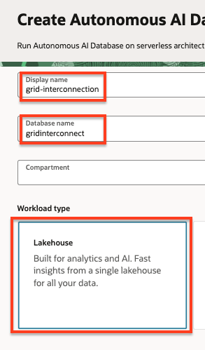

10. Under the **Database configuration** section, enable the **Developer** option.

11. Select **26ai** as the version under **Choose database version**.

    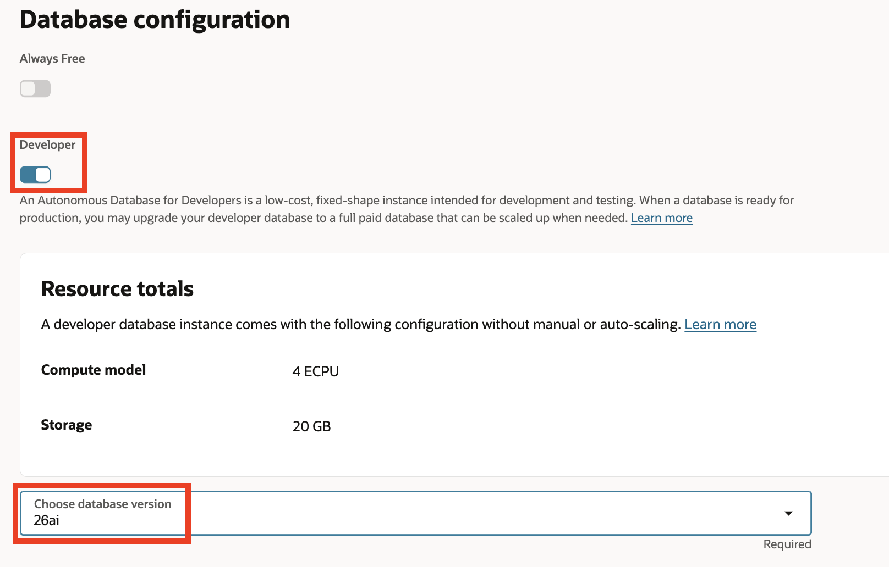

12. Under the **Administrator credentials creation** section, type a password (for example: `myPassword123`), in the **Password** field and confirm the password in the **Confirm password** field. Please make sure to choose a password you'd remember as we are going to need to type this password later.

13. Under the **Network access** section, make sure that the **Secure access from everywhere** option is selected.

    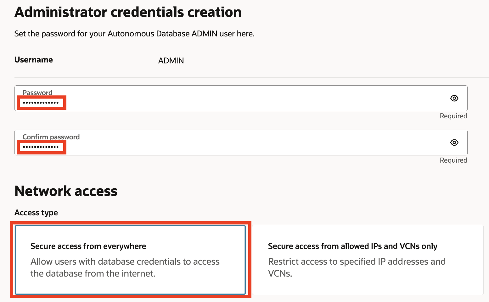

14. Click the **Create** button at the bottom of the screen.

Once the database instance is created, you can move on to the next task (this may take a few minutes).

## Task 2: Create the database schema

In this task we are going to use SQL scripts to create the database schema which consists of tables and sequences (which will take care of inserting unique values for the various IDs like the interconnection request ID or PV system ID etc.).

1. Once the ADB instance is created, click the **Database actions** drop down and select the **SQL** option. This should launch a new tab in your browser with the SQL application (dismiss any messages if you see any).

    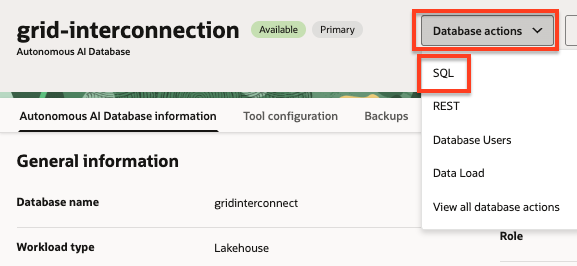

2. Copy the following sql statements, paste them into the SQL worksheet and click the green **Run Statement** button at the top.

    ```sql
    CREATE TABLE PV_Systems (
      SystemID             NUMBER PRIMARY KEY,
      ExternalSystemID     VARCHAR2(20) UNIQUE,
      InstallerName        VARCHAR2(100) NOT NULL,
      SiteAddress          VARCHAR2(200),
      City                 VARCHAR2(50),
      State                VARCHAR2(2),
      ZipCode              VARCHAR2(10),
      SystemCapacityKW     NUMBER,
      InverterManufacturer VARCHAR2(100),
      InverterModel        VARCHAR2(100),
      InverterCertification VARCHAR2(50)
    );

    CREATE TABLE Grid_Operators (
      OperatorID NUMBER PRIMARY KEY,
      FirstName  VARCHAR2(50) NOT NULL,
      LastName   VARCHAR2(50) NOT NULL,
      Email      VARCHAR2(100) UNIQUE NOT NULL,
      Phone      VARCHAR2(20),
      Region     VARCHAR2(50)
    );

    CREATE TABLE Request_Status (
      StatusID   NUMBER PRIMARY KEY,
      StatusName VARCHAR2(50) NOT NULL
    );

    CREATE TABLE Interconnection_Requests (
      RequestID           NUMBER PRIMARY KEY,
      ApplicationID       NUMBER UNIQUE NOT NULL,
      SystemID            NUMBER NOT NULL,
      RequestType         VARCHAR2(50) NOT NULL,
      RequestedCapacityKW NUMBER NOT NULL,
      VoltageLevel        VARCHAR2(20),
      GridImpactScore     NUMBER,
      SubmittedDate       DATE DEFAULT SYSTIMESTAMP NOT NULL,
      LastUpdatedDate     DATE DEFAULT SYSTIMESTAMP NOT NULL,
      StatusID            NUMBER NOT NULL,
      AssignedOperatorID  NUMBER,
      InverterCompliant   VARCHAR2(3),
      LocalGridCapacityMW NUMBER,
      CONSTRAINT fk_ir_system   FOREIGN KEY (SystemID) REFERENCES PV_Systems(SystemID),
      CONSTRAINT fk_ir_status   FOREIGN KEY (StatusID) REFERENCES Request_Status(StatusID),
      CONSTRAINT fk_ir_operator FOREIGN KEY (AssignedOperatorID) REFERENCES Grid_Operators(OperatorID)
    );

    -- Sequences + Triggers
    CREATE SEQUENCE SystemSeq START WITH 1 INCREMENT BY 1;
    /
    CREATE OR REPLACE TRIGGER SystemTrigger
    BEFORE INSERT ON PV_Systems
    FOR EACH ROW
    BEGIN
      SELECT SystemSeq.NEXTVAL INTO :NEW.SystemID FROM DUAL;
    END;
    /
    CREATE SEQUENCE OperatorSeq START WITH 1 INCREMENT BY 1;
    /
    CREATE OR REPLACE TRIGGER OperatorTrigger
    BEFORE INSERT ON Grid_Operators
    FOR EACH ROW
    BEGIN
      SELECT OperatorSeq.NEXTVAL INTO :NEW.OperatorID FROM DUAL;
    END;
    /
    CREATE SEQUENCE RequestStatusSeq START WITH 1 INCREMENT BY 1;
    /
    CREATE OR REPLACE TRIGGER RequestStatusTrigger
    BEFORE INSERT ON Request_Status
    FOR EACH ROW
    BEGIN
      SELECT RequestStatusSeq.NEXTVAL INTO :NEW.StatusID FROM DUAL;
    END;
    /
    CREATE SEQUENCE InterconnectionSeq START WITH 1 INCREMENT BY 1;
    /
    CREATE OR REPLACE TRIGGER InterconnectionTrigger
    BEFORE INSERT ON Interconnection_Requests
    FOR EACH ROW
    BEGIN
      SELECT InterconnectionSeq.NEXTVAL INTO :NEW.RequestID FROM DUAL;
    END;
    /
    ```

    

    >NOTE: You should see an output similar to the following:

    

## Task 3: Insert data

In this task we are going to fill the database tables with data. One after the other, copy each of the following SQL sections, <u>in order</u>, and paste each statement into the SQL worksheet, <u>replacing any existing text</u>. After the statement has been pasted, click the **Run Script** button.

  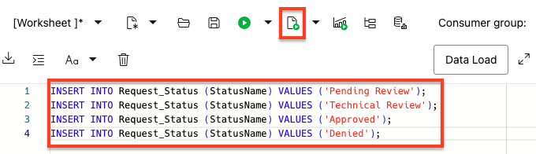

It is important to make sure that you only copy & execute a single section at a time. Don't forget to select all of the text in the worksheet before executing the statement. After you execute a statement look for an output similar to the following:

  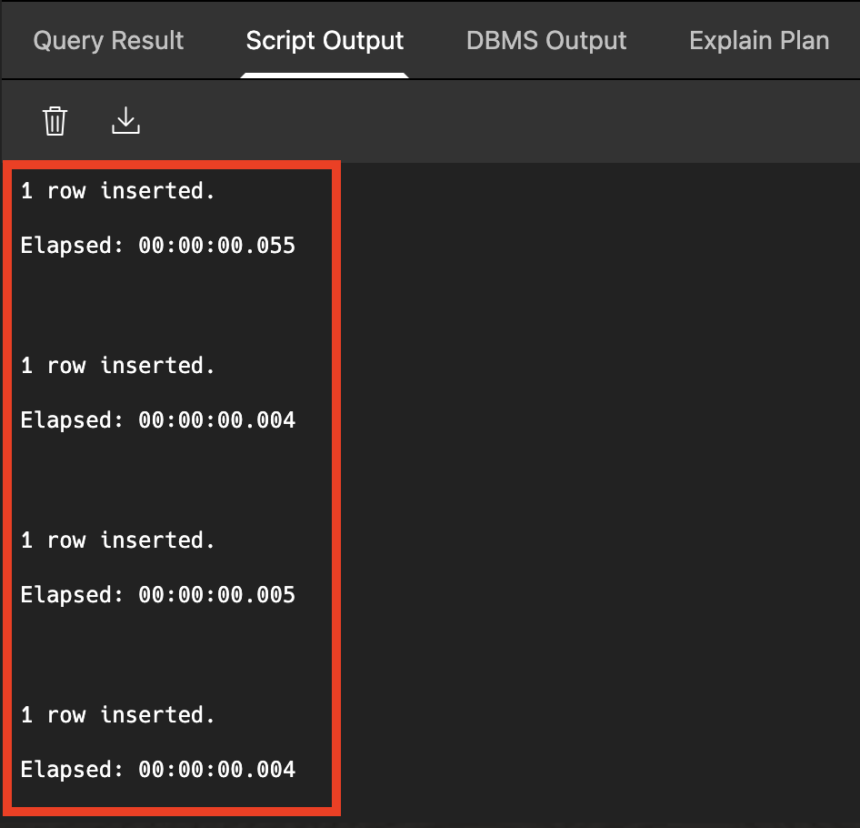

1. Insert data into the **Request_Status** table:

    ```sql
    INSERT INTO Request_Status (StatusName) VALUES ('Pending Review');
    INSERT INTO Request_Status (StatusName) VALUES ('Technical Review');
    INSERT INTO Request_Status (StatusName) VALUES ('Approved');
    INSERT INTO Request_Status (StatusName) VALUES ('Denied');
    ```

2. Insert data into the **Grid_Operators** table:

    ```sql
    INSERT INTO Grid_Operators (FirstName, LastName, Email, Phone, Region)
    VALUES ('Emma','Johnson','emma.johnson@utilitygrid.com','555-123-4567','Southwest');
    INSERT INTO Grid_Operators (FirstName, LastName, Email, Phone, Region)
    VALUES ('Liam','Smith','liam.smith@utilitygrid.com','555-234-5678','West Coast');
    INSERT INTO Grid_Operators (FirstName, LastName, Email, Phone, Region)
    VALUES ('Olivia','Brown','olivia.brown@utilitygrid.com','555-345-6789','California');
    INSERT INTO Grid_Operators (FirstName, LastName, Email, Phone, Region)
    VALUES ('Noah','Davis','noah.davis@utilitygrid.com','555-456-7890','Midwest');
    INSERT INTO Grid_Operators (FirstName, LastName, Email, Phone, Region)
    VALUES ('Sophia','Wilson','sophia.wilson@utilitygrid.com','555-567-8901','Southeast');
    INSERT INTO Grid_Operators (FirstName, LastName, Email, Phone, Region)
    VALUES ('Mason','Garcia','mason.garcia@utilitygrid.com','555-678-9012','Northeast');
    INSERT INTO Grid_Operators (FirstName, LastName, Email, Phone, Region)
    VALUES ('Isabella','Martinez','isabella.martinez@utilitygrid.com','555-789-0123','Texas');
    INSERT INTO Grid_Operators (FirstName, LastName, Email, Phone, Region)
    VALUES ('Ethan','Lopez','ethan.lopez@utilitygrid.com','555-890-1234','Mountain');
    INSERT INTO Grid_Operators (FirstName, LastName, Email, Phone, Region)
    VALUES ('Ava','Hernandez','ava.hernandez@utilitygrid.com','555-901-2345','Pacific Northwest');
    INSERT INTO Grid_Operators (FirstName, LastName, Email, Phone, Region)
    VALUES ('James','Nguyen','james.nguyen@utilitygrid.com','555-012-3456','Great Plains');
    ```

3. Insert data into the **PV_Systems** table:

    ```sql
    INSERT INTO PV_Systems (ExternalSystemID, InstallerName, SiteAddress, City, State, ZipCode, SystemCapacityKW, InverterManufacturer, InverterModel, InverterCertification)
    VALUES ('PV_22000', 'SunPower Solutions', NULL, 'Phoenix', 'AZ', '85001', 150, 'SolarEdge', 'SE7600H-US', 'None');

    INSERT INTO PV_Systems (ExternalSystemID, InstallerName, SiteAddress, City, State, ZipCode, SystemCapacityKW, InverterManufacturer, InverterModel, InverterCertification)
    VALUES ('PV_30000', 'GreenTech Solar', NULL, 'Sacramento', 'CA', '94203', 200, 'Enphase', 'IQ8PLUS-72-2-US', 'UL1741');

    INSERT INTO PV_Systems (ExternalSystemID, InstallerName, SiteAddress, City, State, ZipCode, SystemCapacityKW, InverterManufacturer, InverterModel, InverterCertification)
    VALUES ('PV_20000', 'Bright Energy', NULL, 'San Diego', 'CA', '92101', 350, 'SMA', 'SB7.7-1SP-US-41', 'UL1741');

    INSERT INTO PV_Systems (ExternalSystemID, InstallerName, SiteAddress, City, State, ZipCode, SystemCapacityKW, InverterManufacturer, InverterModel, InverterCertification)
    VALUES ('PV_21000', 'Desert Sun Installers', NULL, 'Tucson', 'AZ', '85701', 500, 'Fronius', 'Primo-15.0-1', 'UL1741');

    INSERT INTO PV_Systems (ExternalSystemID, InstallerName, SiteAddress, City, State, ZipCode, SystemCapacityKW, InverterManufacturer, InverterModel, InverterCertification)
    VALUES ('PV_28000', 'Midwest Solar Co', NULL, 'Chicago', 'IL', '60601', 275, 'SolarEdge', 'SE10000H-US', 'UL1741');

    INSERT INTO PV_Systems (ExternalSystemID, InstallerName, SiteAddress, City, State, ZipCode, SystemCapacityKW, InverterManufacturer, InverterModel, InverterCertification)
    VALUES ('PV_13000', 'Texas Renewable Energy', NULL, 'Austin', 'TX', '78701', 1000, 'ABB', 'PVS-175-TL', 'IEEE1547');

    INSERT INTO PV_Systems (ExternalSystemID, InstallerName, SiteAddress, City, State, ZipCode, SystemCapacityKW, InverterManufacturer, InverterModel, InverterCertification)
    VALUES ('PV_6000', 'Southeast Solar Services', NULL, 'Atlanta', 'GA', '30303', 125, 'Enphase', 'IQ7PLUS-72-2-US', 'UL1741');

    INSERT INTO PV_Systems (ExternalSystemID, InstallerName, SiteAddress, City, State, ZipCode, SystemCapacityKW, InverterManufacturer, InverterModel, InverterCertification)
    VALUES ('PV_27000', 'Pacific Power Systems', NULL, 'Portland', 'OR', '97201', 450, 'SMA', 'STP50-US-41', 'UL1741');
    ```

4. Insert data into the **Interconnection_Requests** table:

    ```sql
    -- DENIED request - Inverter non-compliant (no certification)
    INSERT INTO Interconnection_Requests (ApplicationID, SystemID, RequestType, RequestedCapacityKW, VoltageLevel, GridImpactScore, SubmittedDate, LastUpdatedDate, StatusID, AssignedOperatorID, InverterCompliant, LocalGridCapacityMW)
    SELECT 1005, s.SystemID, 'New', 150, '480V', 65, TO_DATE('03-JUN-25','DD-MON-YY'), TO_DATE('16-JUN-25','DD-MON-YY'),
      (SELECT StatusID FROM Request_Status WHERE StatusName='Denied'), 1, 'No', 5.2
    FROM PV_Systems s WHERE s.ExternalSystemID='PV_22000';

    -- DENIED request - Exceeds local grid capacity
    INSERT INTO Interconnection_Requests (ApplicationID, SystemID, RequestType, RequestedCapacityKW, VoltageLevel, GridImpactScore, SubmittedDate, LastUpdatedDate, StatusID, AssignedOperatorID, InverterCompliant, LocalGridCapacityMW)
    SELECT 1006, s.SystemID, 'New', 200, '480V', 82, TO_DATE('15-JUN-25','DD-MON-YY'), TO_DATE('30-JUN-25','DD-MON-YY'),
      (SELECT StatusID FROM Request_Status WHERE StatusName='Denied'), 2, 'Yes', 0.15
    FROM PV_Systems s WHERE s.ExternalSystemID='PV_30000';

    -- APPROVED request - All compliant
    INSERT INTO Interconnection_Requests (ApplicationID, SystemID, RequestType, RequestedCapacityKW, VoltageLevel, GridImpactScore, SubmittedDate, LastUpdatedDate, StatusID, AssignedOperatorID, InverterCompliant, LocalGridCapacityMW)
    SELECT 1007, s.SystemID, 'Upgrade', 350, '12kV', 45, TO_DATE('16-JUN-25','DD-MON-YY'), TO_DATE('01-JUL-25','DD-MON-YY'),
      (SELECT StatusID FROM Request_Status WHERE StatusName='Approved'), 3, 'Yes', 8.5
    FROM PV_Systems s WHERE s.ExternalSystemID='PV_20000';

    -- PENDING REVIEW request - Large commercial system
    INSERT INTO Interconnection_Requests (ApplicationID, SystemID, RequestType, RequestedCapacityKW, VoltageLevel, GridImpactScore, SubmittedDate, LastUpdatedDate, StatusID, AssignedOperatorID, InverterCompliant, LocalGridCapacityMW)
    SELECT 1008, s.SystemID, 'New', 500, '12kV', 72, TO_DATE('16-JUL-25','DD-MON-YY'), TO_DATE('01-AUG-25','DD-MON-YY'),
      (SELECT StatusID FROM Request_Status WHERE StatusName='Pending Review'), 1, 'Yes', 6.0
    FROM PV_Systems s WHERE s.ExternalSystemID='PV_21000';

    -- TECHNICAL REVIEW request - Midwest region
    INSERT INTO Interconnection_Requests (ApplicationID, SystemID, RequestType, RequestedCapacityKW, VoltageLevel, GridImpactScore, SubmittedDate, LastUpdatedDate, StatusID, AssignedOperatorID, InverterCompliant, LocalGridCapacityMW)
    SELECT 1011, s.SystemID, 'Modification', 275, '480V', 55, TO_DATE('16-AUG-25','DD-MON-YY'), TO_DATE('26-AUG-25','DD-MON-YY'),
      (SELECT StatusID FROM Request_Status WHERE StatusName='Technical Review'), 4, 'Yes', 4.5
    FROM PV_Systems s WHERE s.ExternalSystemID='PV_28000';

    -- APPROVED request - Large utility-scale system
    INSERT INTO Interconnection_Requests (ApplicationID, SystemID, RequestType, RequestedCapacityKW, VoltageLevel, GridImpactScore, SubmittedDate, LastUpdatedDate, StatusID, AssignedOperatorID, InverterCompliant, LocalGridCapacityMW)
    SELECT 1013, s.SystemID, 'New', 1000, '69kV', 35, TO_DATE('10-JUL-25','DD-MON-YY'), TO_DATE('20-JUL-25','DD-MON-YY'),
      (SELECT StatusID FROM Request_Status WHERE StatusName='Approved'), 7, 'Yes', 25.0
    FROM PV_Systems s WHERE s.ExternalSystemID='PV_13000';

    -- PENDING REVIEW request - Residential system
    INSERT INTO Interconnection_Requests (ApplicationID, SystemID, RequestType, RequestedCapacityKW, VoltageLevel, GridImpactScore, SubmittedDate, LastUpdatedDate, StatusID, AssignedOperatorID, InverterCompliant, LocalGridCapacityMW)
    SELECT 1015, s.SystemID, 'New', 125, '240V', 25, TO_DATE('26-JUL-25','DD-MON-YY'), TO_DATE('01-AUG-25','DD-MON-YY'),
      (SELECT StatusID FROM Request_Status WHERE StatusName='Pending Review'), 5, 'Yes', 3.2
    FROM PV_Systems s WHERE s.ExternalSystemID='PV_6000';
    ```

## Task 4: Create a Vault to securely store the database connection information

In this task we are going to create a Vault and an encryption key. We are going to use this vault to securely store the password used to connect to the database as a secret. This secret is going to be used in the next section by the database connection.

1. Click the navigation menu on the top left.

2. Click **Identity & Security**.

3. Click **Vault** under Key Management & Secret Management.

    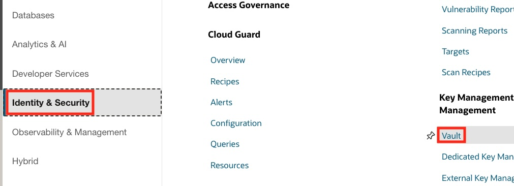

4. Under the **List scope** section, make sure that the root compartment is selected.

5. Click the **Create Vault** button at the top of the Vaults table.

    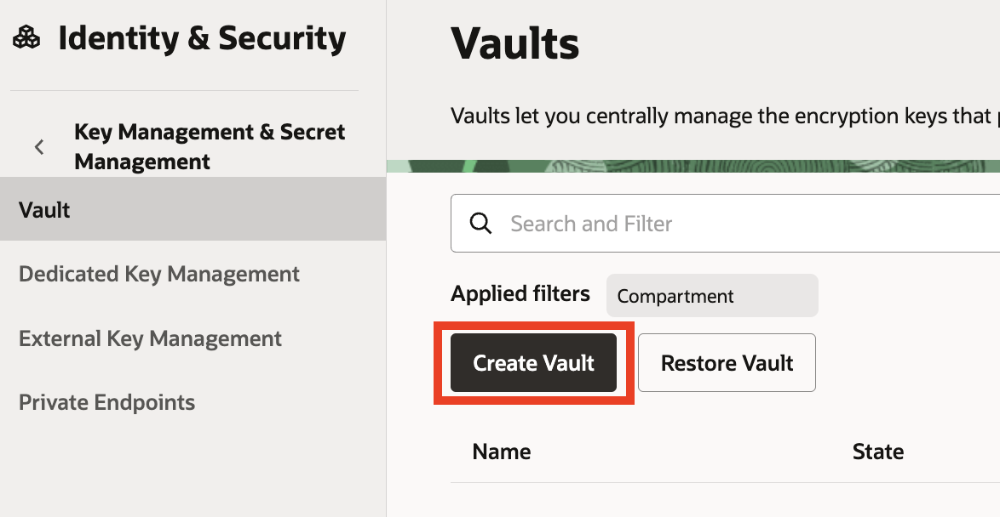

6. Under the **Create in Compartment**, make sure that the root compartment is selected.

7. For the **Name** field use: `grid-interconnection-secrets`

8. Click the **Create Vault** button at the bottom of the form.

    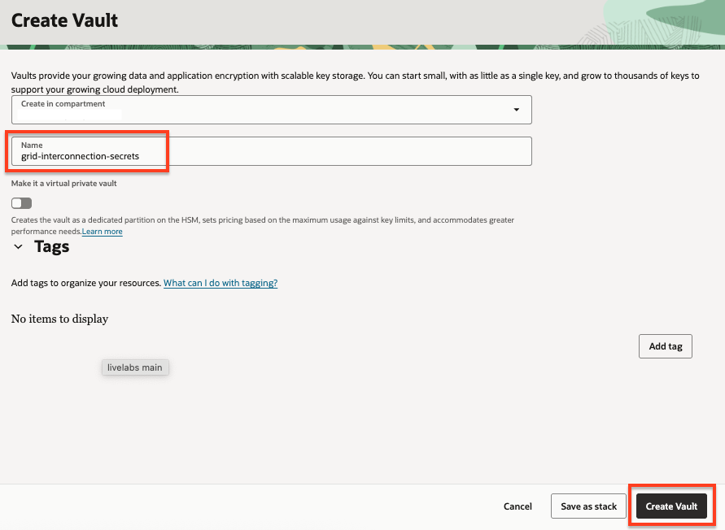

9. Wait for the vault to be created.

    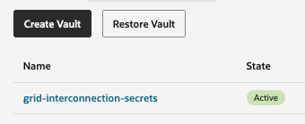

10. Once the vault is created, click it's name from the Vaults list.

11. Under the **List scope** section, make sure that the root compartment is selected.

12. Click the **Create Key** button at the top of the Master Encryption Keys table.

    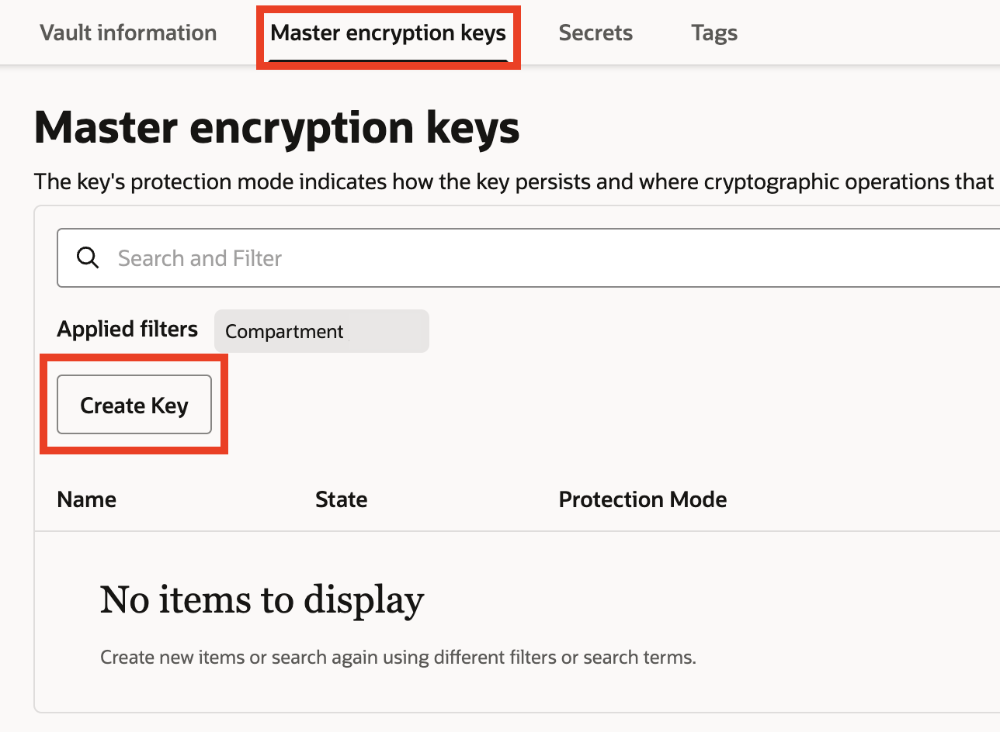

13. Under the **Create in Compartment**, make sure that the root compartment is selected.

14. For the **Name** field use: `grid-interconnection-key`

15. Click the **Create Key** button.

    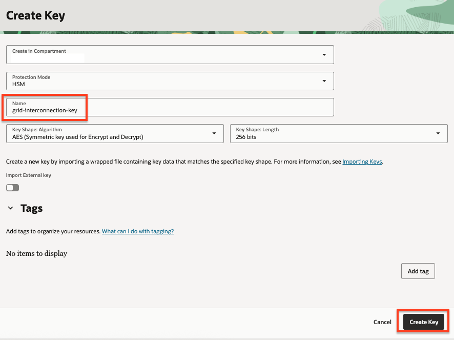

## Task 5: Create a database connection

In this section we are going to create a connection to our database. This connection is going to be used by the agent to retrieve information from the database.

1. Click the navigation menu on the top left.

2. Click **Developer Services**.

3. Click **Connections** under Database Tools.

    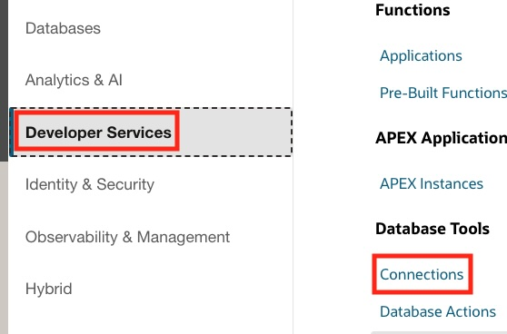

4. Under the **List scope** section, make sure that the root compartment is selected.

5. Click the **Create Connection** button at the top of the Connections table.

    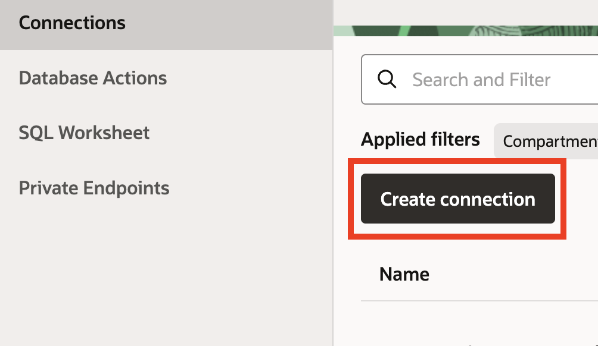

6. For the **Name** field use: `grid-interconnection`

7. Under the **Compartment**, make sure that the root compartment is selected.

8. Make sure that the **Select database** option is selected under the Database details section.

9. In the **Database cloud service** drop-down, select **Oracle Autonomous AI Database**.

10. In the **Database in...** drop down, select the **grid-interconnection** database.

11. In the **Username** field, type: `ADMIN`

    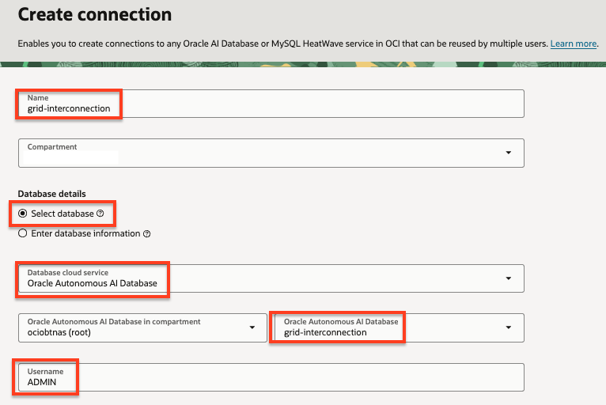

12. Under the **User password secret in...** drop-down, click the **Create password secret** button.

    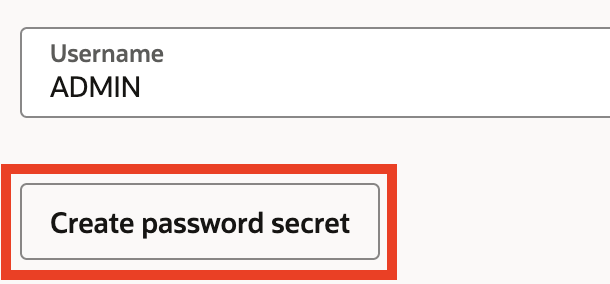

This step will create a secret which will be stored in the Vault created earlier and will contain the password for connecting to the database.

13. For the **Name** field use: `grid-interconnection-admin-password`

14. Select the **grid-interconnection-secrets** in the **Vault in...** drop-down.

15. Select the **grid-interconnection-key** in the **Encryption key in...** drop-down.

16. In the **User password** field, type the password you've used when you created the ADB instance.

17. Do the same in the **Confirm user password** field.

18. Click the **Create** button.

    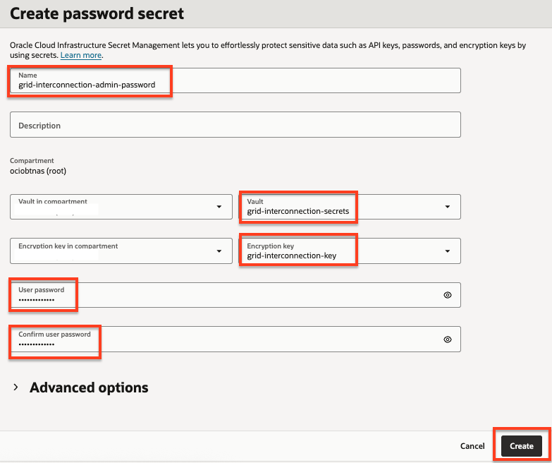

19. Back in the Create connection panel, the newly created password secret is automatically selected in the **User password secret in...** drop-down.

    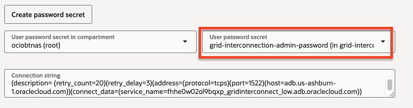

20. Under the **SSL details** section, click the **Create wallet content secret** button. This will create a secret which will help the agent securely communicate with the database.

21. For the **Name** field use: `grid-interconnection-wallet-secret`

22. Select the **grid-interconnection-secrets** in the **Vault in...** drop-down.

23. Select the **grid-interconnection-key** in the **Encryption key in...** drop-down.

24. Under the **Wallet** section, select the **Retrieve regional wallet from Autonomous Database** option.

25. Click the **Create** button.

    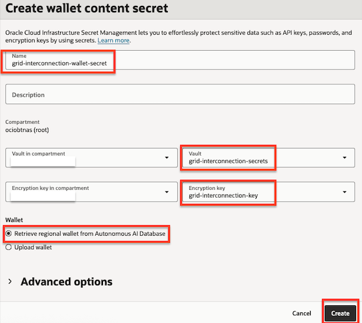

26. Back in the Create connection panel, the newly created wallet secret is automatically selected in the **SSO wallet content secret in...** drop-down.

27. Click the **Create** button.

    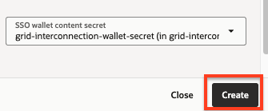

## Task 6: Validate the connection

In this task we are going to make sure that the connection was created successfully.

1. After the connection was created, click **Validate** button on the top right of the connection page.

    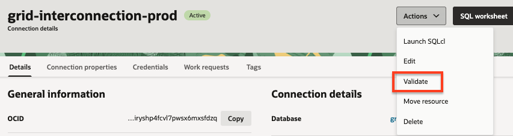

2. Click the **Validate** button at the bottom of the Validate connection dialog.

    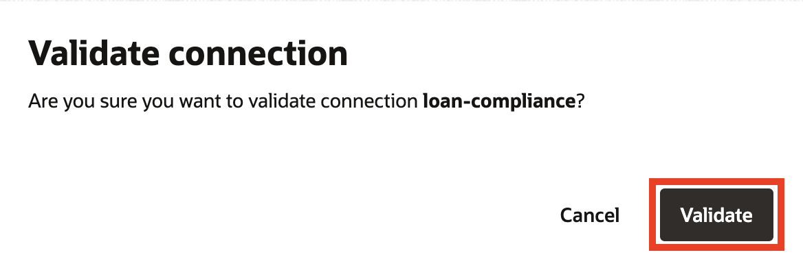

3. If everything was configured correctly, you should see a result similar to the following:

    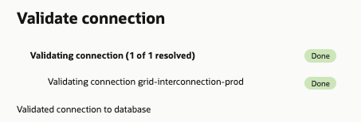

4. You can click the **Close** link to exit the dialog.

    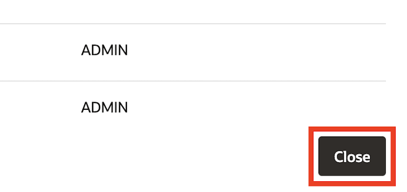

You may now proceed to the next lab.

## Learn More

- [Provision an Autonomous AI Database Instance](https://docs.oracle.com/en-us/iaas/autonomous-database/doc/autonomous-provision.html)
- [Connect with Built-In Oracle Database Actions](https://docs.oracle.com/en-us/iaas/autonomous-database/doc/connecting-built-oracle-database-actions.html)
- [Creating a Vault](https://docs.oracle.com/en-us/iaas/Content/KeyManagement/Tasks/managingvaults.htm)
- [Creating a Master Encryption Key](https://docs.oracle.com/en-us/iaas/Content/KeyManagement/Tasks/managingkeys.htm)
- [Database Tools - Creating a Connection](https://docs.oracle.com/en-us/iaas/database-tools/doc/creating-connection.html)

## Acknowledgements

- **Author** - Deion Locklear
- **Contributors** - Hanna Rakhsha, Daniel Hart, Uma Kumar, Anthony Marino
