# Lab 1: Prepare Development Environment

## Introduction

For the entirety of this workshop, you'll need just an Autonomous Database running Oracle AI Database 26ai and a local IDE. In this section you'll get logged into your OCI Sandbox environment, provision the DB, and set up the pre-requisites in Microsoft Visual Studio Code (installed locally on your machine).

This workshop has been tested with VS Code on both Mac and Windows. If you prefer to use a different IDE, some of the instructions in this section may vary slightly.

**Estimated Time:** 15 minutes

### Objectives

In this lab, you will:

1. Log into the provided OCI tenancy
2. Use Cloud Shell / CLI to provision the Autonomous Database (ADB)
3. Set up VS Code with a Python virtual environment and Jupyter support
4. Download the Proteus workshop package (pre-built Python modules)
5. Connect to the ADB instance and create a dedicated user for vector operations

### Prerequisites

This lab assumes you have:

* Provisioned the Workshop using the LiveLabs Sandbox
* Retrieved your account credentials from the LiveLabs UI
* Have Microsoft VS Code installed on your computer

## Task 1: Log into the OCI Tenancy

1. Click the **View Login Info** link to access account information.

    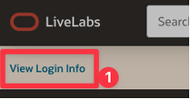

2. Locate and copy the Compartment OCID value. Store it in a text file to use in just a minute.

3. Click the **[Launch OCI]** button and log in with the *Username* and *Password* provided.

    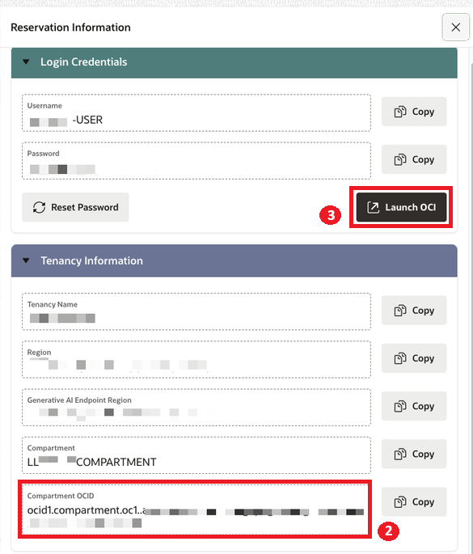

4. You should land on the OCI Dashboard, at which point you can proceed to the next task.

## Task 2: Create an Autonomous Database Instance

1. Open Cloud Shell

    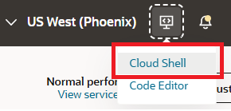

2. Copy the following command. Replace `<your-compartment-ocid>` with the value copied earlier.

    ```bash
    <copy>
    oci db autonomous-database create \
    --compartment-id "<your-compartment-ocid>" \
    --db-name "memengdb" \
    --admin-password 'WElcome123##' \
    --compute-model ECPU \
    --compute-count 4 \
    --data-storage-size-in-tbs 1 \
    --display-name 'MemoryEngineering' \
    --is-free-tier false \
    --license-model LICENSE_INCLUDED \
    --db-workload DW \
    --db-version 26ai
    </copy>
    ```

    >NOTE: You're welcome to choose your own `admin-password` and/or `display-name` if you'd like.

3. The command will return a large block of JSON. Wait for the provisioning to complete.

4. Use the navigation menu to visit the Autonomous AI Database service console.

    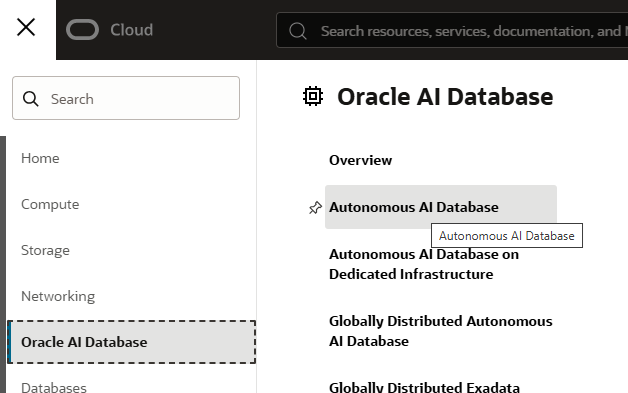

5. Once the *State* of the database is `Available`, click the name of the DB instance.

    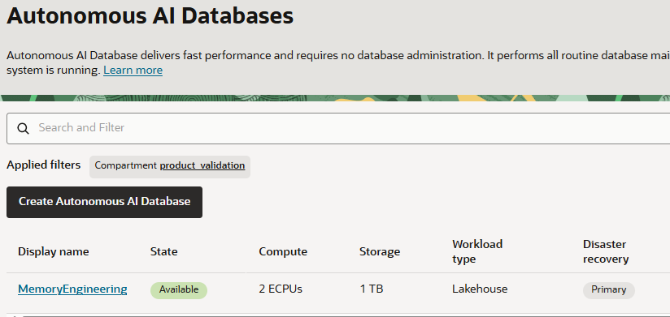

6. Scroll down the page and locate the **Network** section.

    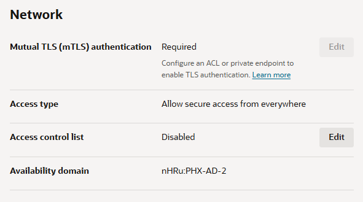

7. Click the **[Edit]** button next to **`Access control list`**.

8. Click the *Add my IP address* toggle switch. The Values field will populate with the external IP of your current machine.

    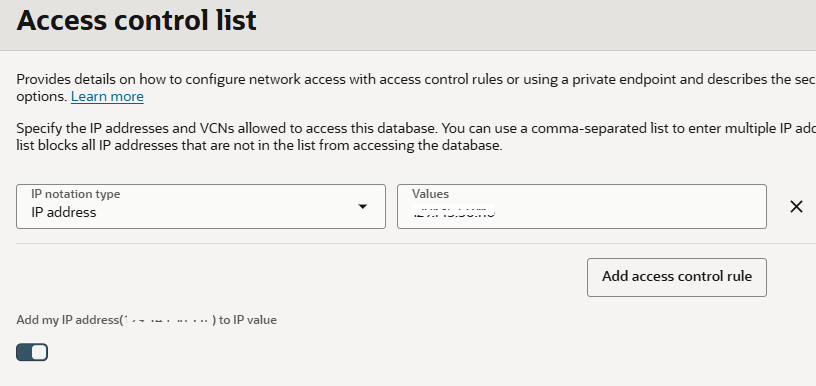

9. Click **[Save]** and allow the database a minute or so to update. Once the **[Edit]** button next to *Mutual TLS (mTLS) authentication* is no longer grayed out, proceed to the next step.

10. Click said **[Edit]** button next to the mTLS setting. Click the toggle switch to not require mTLS auth. Click **[Save]**.

    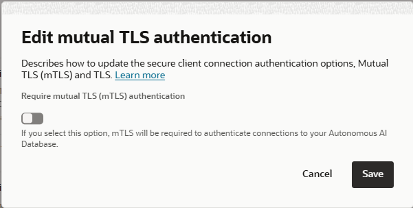

11. Scroll back to the top and click the **[Database connection]** button. Locate and copy the full **Connection string** for the TNS name that corresponds with `medium`. Paste it in a notepad for future reference.

    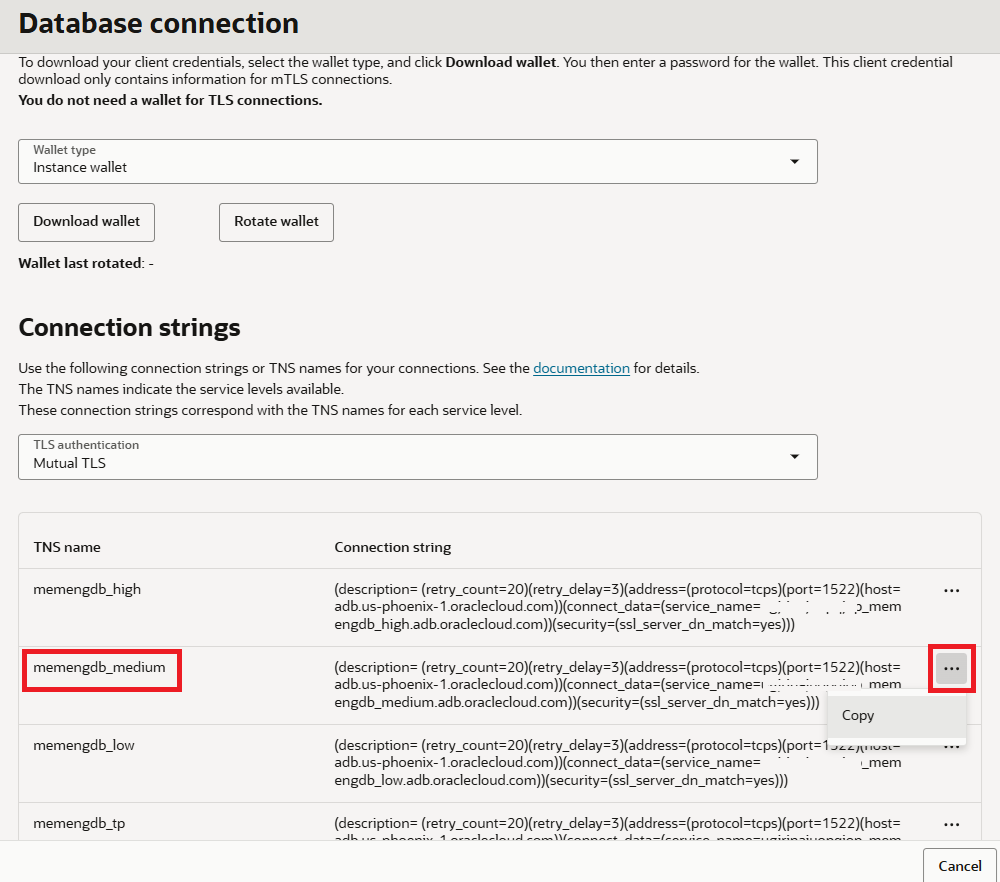

12. Time to retrieve the workshop artifacts.

## Task 3: Download the Proteus Workshop Package

The subsequent labs in this workshop use a pre-built Python package called `proteus` that contains the memory engine, toolbox, context utilities, agent harness, and Streamlit chat UI. Labs 2-4 import from this package rather than defining code inline.

1. [CLICK HERE](https://github.com/enschilling/workshop-dev/raw/refs/heads/main/oci-ai-database-memory-context-engineering/files/mem-workshop.zip) to download the `proteus-workshop` package from the workshop repository. Then unzip the package to your local filesystem.

2. Verify the package structure:

    ```
    proteus-workshop/
    ├── requirements.txt
    ├── proteus/
    │   ├── __init__.py
    │   ├── config.py
    │   ├── db.py
    │   ├── vector_store.py
    │   ├── memory_manager.py
    │   ├── toolbox.py
    │   ├── context.py
    │   ├── tools.py
    │   ├── agent.py
    │   └── app.py
    └── notebooks/
        ├── lab-2-build-memory-engine.ipynb
        ├── lab-3-context-engineering.ipynb
        └── lab-4-agent-execution.ipynb
    ```

3. Start Visual Studio Code and open the `proteus-workshop` folder. For the remaining labs, you'll open the corresponding `.ipynb` file from the `notebooks/` folder. But don't get ahead of yourself just yet!

## Task 4: Create Jupyter Environment in VS Code

For this lab, you will create a new `.ipynb` file and copy in the code to prep the database. The remainder of the labs use dedicated notebooks that import from the pre-built `proteus` Python package.

<details><summary>IDE Setup in Windows</summary>

1. Ensure that you have **`Python 3.11.9`** or newer installed.

    * Use the Python installer to get the latest version: [Download Python Installer for Windows](https://www.python.org/downloads/release/pymanager-260/)

    * Use `pyenv-win` to install and manage multiple versions of Python.

        * Open **PowerShell as an Administrator**
        * Run `Get-ExecutionPolicy` - if it is anything other than *Unrestricted* or *RemoteSigned*, you'll need to run `Set-ExecutionPolicy RemoteSigned`
        * Install `pyenv-win` with this command:
            ```bash
            <copy>
            Invoke-WebRequest -UseBasicParsing -Uri "https://raw.githubusercontent.com/pyenv-win/pyenv-win/master/pyenv-win/install-pyenv-win.ps1" -OutFile "./install-pyenv-win.ps1"; &"./install-pyenv-win.ps1"
            </copy>
            ```
        * Install the latest version of v3.12: `pyenv install 3.12.10`

2. Open VS Code and close any existing tabs.

3. Create a new Workspace: **File** -> **Open Folder**

4. Select an existing folder where you'd like to create your workspace, or create and select a new folder.

    >NOTE: If prompted to trust the authors of the files in this folder, click **[Yes, I trust the authors]**

5. Press `Ctrl+Shift+P` and begin typing "Jupyter". Select `Create: New Jupyter Notebook`.

6. A new `Untitled-1.ipynb` file will be created. Click **[Select Kernel]** in the top right corner.

7. Click *+ Create Python Environment*

8. Choose ***venv** Manages virtual environments created using 'venv'*

9. Select desired Python version and assign a name: `oracle-agent-env`

10. Skip package installation — we'll do that in a separate step.

11. Paste the following and run the code block:

    ```
    <copy>
    pip install -qU oracledb langchain-oracledb langchain langchain-openai langchain-huggingface ipywidgets tavily-python sentence-transformers ipykernel jupyter numpy datasets streamlit matplotlib pydantic
    </copy>
    ```

    >NOTE: This will perform a quiet install that takes 3-5 minutes.

12. Test the installation:

    ```bash
    <copy>
    from openai import OpenAI
    from langchain_huggingface import HuggingFaceEmbeddings
    import oracledb
    </copy>
    ```

    >NOTE: No output is displayed unless there are errors.

13. Restart the kernel before continuing.

</details>

<details><summary>IDE Setup for MacOS</summary>

1. First, make sure you have the necessary tools installed.

    * **Conda:** Install via [Miniconda](https://docs.conda.io/en/latest/miniconda.html) or [Anaconda](https://www.anaconda.com/download)
    * **pyenv:** Install via [pyenv GitHub](https://github.com/pyenv/pyenv) OR `brew install pyenv`
    * **VS Code:** Download at [code.visualstudio.com](https://code.visualstudio.com/)

2. Create a virtual environment using either Conda or pyenv + venv:

    * Option A: Conda:

        ```bash
        <copy>
        conda create -n oracle-agent-env python=3.11
        conda activate oracle-agent-env
        </copy>
        ```

    * Option B: pyenv + venv

        ```bash
        <copy>
        pyenv install 3.11.9
        pyenv local 3.11.9
        python -m venv oracle-agent-env
        source oracle-agent-env/bin/activate
        </copy>
        ```

    >NOTE: Once activated, your terminal prompt shows *(oracle-agent-env)*.

3. Open VS Code and create a new Workspace: **File -> Open Folder**

4. Select an existing folder or create and select a new one.

    >NOTE: If prompted to trust the authors, click **[Yes, I trust the authors]**

5. Press *Cmd+Shift+P* and select *Create: New Jupyter Notebook*

    >NOTE: You may need the [Python extension](https://marketplace.visualstudio.com/items?itemName=ms-python.python) and [Jupyter extension](https://marketplace.visualstudio.com/items?itemName=ms-toolsai.jupyter).

6. Confirm the kernel in the top right corner matches your environment.

7. Install dependencies:

    ```bash
    <copy>
    pip install -qU oracledb langchain-oracledb langchain langchain-openai langchain-huggingface ipywidgets tavily-python sentence-transformers ipykernel jupyter numpy datasets streamlit matplotlib pydantic
    </copy>
    ```

    >NOTE: This may take 3-5 minutes.

8. Test the installation:

    ```bash
    <copy>
    from openai import OpenAI
    from langchain_huggingface import HuggingFaceEmbeddings
    import oracledb
    </copy>
    ```

9. Restart the kernel before proceeding.

</details>

## Task 5: Connect to the database and create VECTOR user

1. Now test the connection using the OracleDB driver for Python. When you run this code block, VS Code will prompt you for three values. After entering these three values, the code block will finish executing.

    * Your autonomous database admin password
    * Your chosen VECTOR user password (recommended: MemoryContext_2026)
    * The DSN for your Autonomous DB _medium listener

    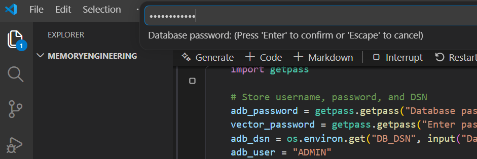

    ```python
    <copy>

    import oracledb
    import os
    import getpass

    # Store username, password, and DSN
    adb_password = getpass.getpass("Database password: ")
    vector_password = getpass.getpass("Enter password for VECTOR (e.g. MemoryContext_2026): ")
    adb_dsn = os.environ.get("DB_DSN", input("Database DSN copied earlier: "))
    adb_user = "ADMIN"
    vector_user = "VECTOR"

    %store adb_dsn vector_user vector_password
    try:
        connection = oracledb.connect(
            user=adb_user,
            password=adb_password,
            dsn=adb_dsn
        )

        print("Connection Successful")

        with connection.cursor() as cursor:
            cursor.execute("SELECT banner FROM v$version WHERE banner LIKE 'Oracle%'")
            banner = cursor.fetchone()[0]
            print(f"\n{banner}")
            
    except oracledb.Error as error:
        print(f"Error connecting to the database: {error}")

    finally:
        if 'connection' in locals() and connection:
            connection.close()
            print("Connection Closed.")
    </copy>
    ```

    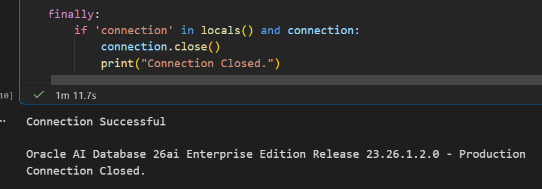

3. Create the VECTOR user.

    ```python
    <copy>

    def setup_oracle_adb(
        create_vector_user=True,
        vector_user=vector_user,
        vector_password=vector_password 
    ) -> bool:
        """
        Connect to Oracle Autonomous Database and create VECTOR user
        
        Args:
            create_vector_user: Whether to create a VECTOR user
            vector_user: Username for the vector user
            vector_password: Password for the vector user
        
        Returns:
            bool: True if setup succeeded, False otherwise
        """
        print("=" * 60)
        print("🚀 ORACLE AUTONOMOUS DATABASE SETUP")
        print("=" * 60)
        
        # Step 1: Install/verify oracledb
        print("\n[1/3] Checking oracledb driver...")
        try:
            import oracledb
            print(f"   ✅ oracledb version {oracledb.__version__} installed")
        except ImportError:
            print("   ❌ oracledb not installed!")
            print("   💡 Install with: pip install oracledb")
            return False
        
        # Step 2: Test connection with wallet
        print("\n[2/3] Testing connection to Autonomous Database...")
        
        try:
            # Configure wallet location for thin mode
            connection = oracledb.connect(
                user=adb_user,
                password=adb_password,
                dsn=adb_dsn
            )
            
            with connection.cursor() as cursor:
                cursor.execute("SELECT banner FROM v$version WHERE ROWNUM = 1")
                version = cursor.fetchone()[0]
                print(f"   ✅ Connected successfully!")
                print(f"   📊 {version}")
            
        except oracledb.Error as e:
            error = e.args[0]
            print(f"   ❌ Connection failed: {error.message}")
            
            # Provide helpful hints based on error code
            if "ORA-01017" in str(error):
                print("   💡 Invalid username/password. Check your credentials.")
            elif "ORA-12154" in str(error):
                print("   💡 TNS could not resolve service name. Check tns_alias parameter.")
            elif "ORA-28759" in str(error):
                print("   💡 Failed to open wallet. Check wallet_password.")
            elif "ORA-28858" in str(error):
                print("   💡 Wallet file error. Re-download the wallet from OCI.")
            
            return False
        
        # Step 3: Create VECTOR user (optional)
        if create_vector_user:
            print(f"\n[3/3] Creating {vector_user} user...")
            
            try:
                with connection.cursor() as cursor:
                    # Check if user exists
                    cursor.execute(
                        "SELECT COUNT(*) FROM all_users WHERE username = :1",
                        [vector_user.upper()]
                    )
                    user_exists = cursor.fetchone()[0] > 0
                    
                    if user_exists:
                        print(f"   ✅ {vector_user} user already exists")
                    else:
                        # Create user with appropriate privileges
                        cursor.execute(f'CREATE USER {vector_user} IDENTIFIED BY "{vector_password}"')
                        cursor.execute(f"GRANT CONNECT, RESOURCE TO {vector_user}")
                        cursor.execute(f"GRANT UNLIMITED TABLESPACE TO {vector_user}")
                        cursor.execute(f"GRANT CREATE TABLE, CREATE SEQUENCE, CREATE VIEW TO {vector_user}")
                        
                        # For vector operations in ADB
                        try:
                            cursor.execute(f"GRANT EXECUTE ON DBMS_VECTOR TO {vector_user}")
                            cursor.execute(f"GRANT EXECUTE ON DBMS_VECTOR_CHAIN TO {vector_user}")
                        except oracledb.Error:
                            # These grants may not be available in all ADB versions
                            pass
                        
                        connection.commit()
                        print(f"   ✅ {vector_user} user created successfully")
                        
            except oracledb.Error as e:
                print(f"   ⚠️  Could not create user: {e.args[0].message}")
                print("   💡 You may need DBA privileges to create users.")
        else:
            print("\n[3/3] Skipping user creation (create_vector_user=False)")
        
        connection.close()
        
        # Success summary
        print("\n" + "=" * 60)
        print("🎉 SETUP COMPLETE!")
        print("=" * 60)
        
        print(f"""
    Connection Details:
        Service: {adb_dsn}
        Admin User: {adb_user}
    """)
        
        if create_vector_user:
            print(f"""    
    Vector User Credentials:
        User: {vector_user}
        Password: {vector_password}
    """)

        return True

    setup_oracle_adb()
    <copy>
    ```

    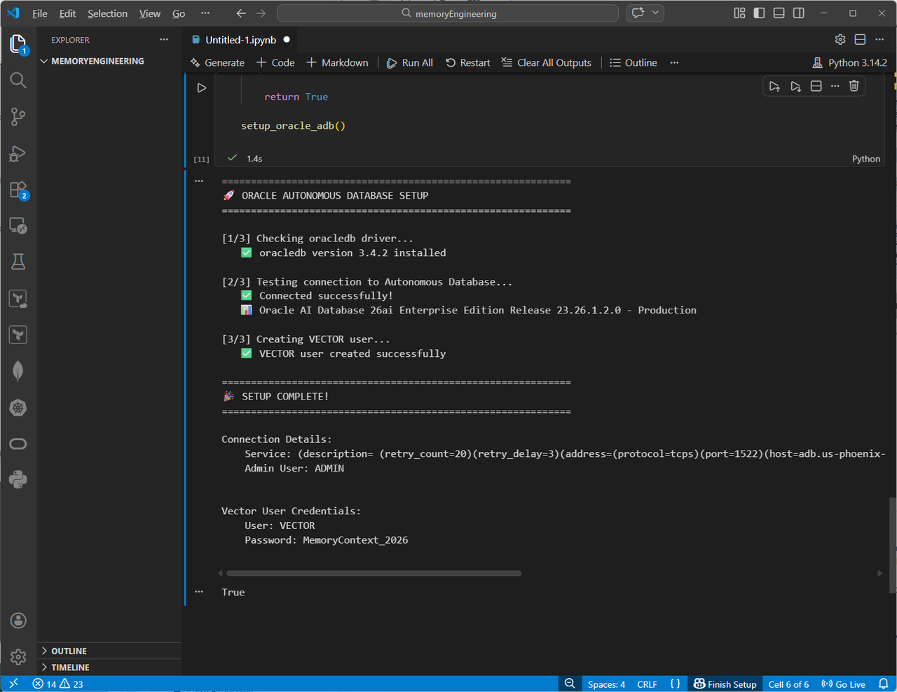

You may now proceed to the next lab.

## Learn More

* [Oracle AI Database Documentation](https://docs.oracle.com/en/database/oracle/oracle-database/26/)
* [python-oracledb Driver Documentation](https://python-oracledb.readthedocs.io/)
* [LangChain OracleVS Integration](https://github.com/oracle/langchain-oracle)

## Acknowledgements

* **Author(s)** - Richmond Alake
* **Contributors** - Eli Schilling
* **Last Updated By/Date** - Published February, 2026
