# Lab 1: Working with Tag Defaults

## Introduction

In this lab, you will create and manage Defined Tags and Tag Defaults in Oracle Cloud Infrastructure (OCI). Tag Defaults enable administrators to automatically apply required tags to resources created within a specific compartment. This ensures governance, standardization, and cost visibility across your environment.
You will create a tag namespace, define tag keys, assign tag defaults to a compartment, and validate enforcement by creating a resource.

**Estimated Time:** 20-25 minutes

### Objectives

In this lab, you will:

- Create a tag namespace **`LLTagNamespace`**
- Create tag key definitions (static and list-based values)
- Review OCI Tag Namespace templates
- Assign Tag Defaults to a compartment
- Validate enforcement by creating an Object Storage bucket

### Prerequisites

This lab assumes you have:

- Completed previous labs
- Administrative access to IAM and compartments
- Access to Cloud Shell or OCI CLI installed and configured (optional for CLI steps)

#### Cloud Shell Setup

- Launch Cloud Shell after logging into the OCI Console

   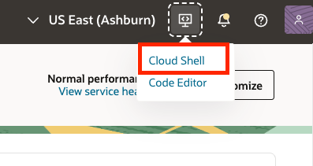

- From the **Actions** menu select **Architecture**. Change it to x86_64 and click **[Change and Restart]**. Then click the **[Restart]** button on the confirmation page.  Cloud Shell will take a minute or so to reload.

   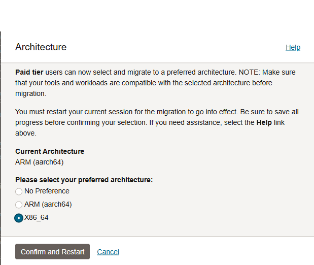

- You can minimize Cloud Shell at any time, but it's highly recommend you don't exit until you finish the workshop. You'll make use of Cloud Shell in subsequent labs.

## Task 1: Create a Tag Namespace

Tag namespaces logically group related tag keys. All defined tags must belong to a namespace.

1. Open the OCI Console.

2. Navigate to **Governance & Adminitstration**.

3. Select **Tag Namespaces**.

   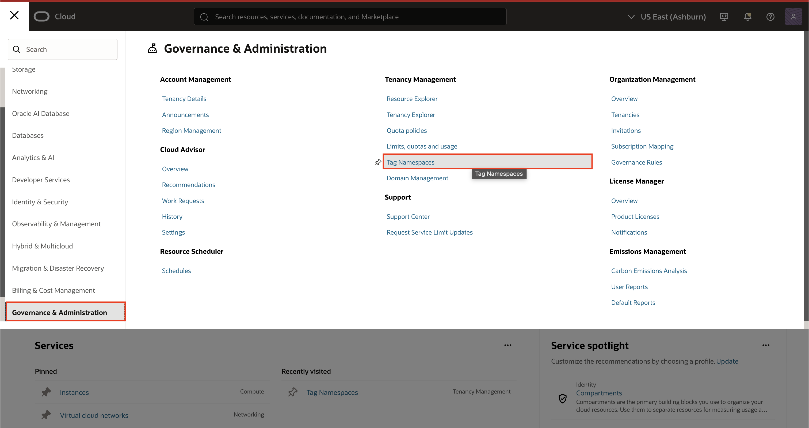

4. Click **Create Tag Namespace**.

   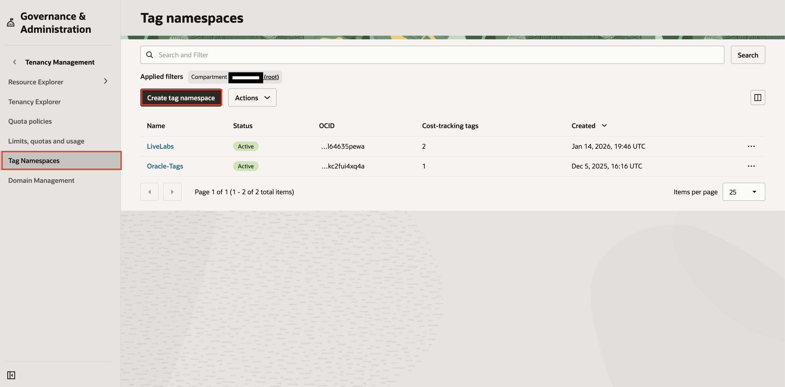

5. Enter:

   **Name**:

    ```text
    <copy>
    LLTagNamespace
    </copy>
    ```

    **Description**:

     ```text
    <copy>
    Collection of pre-defined tags to assist with project and budget allocation of resources.
    </copy>
    ```

6. Click **Create**.

   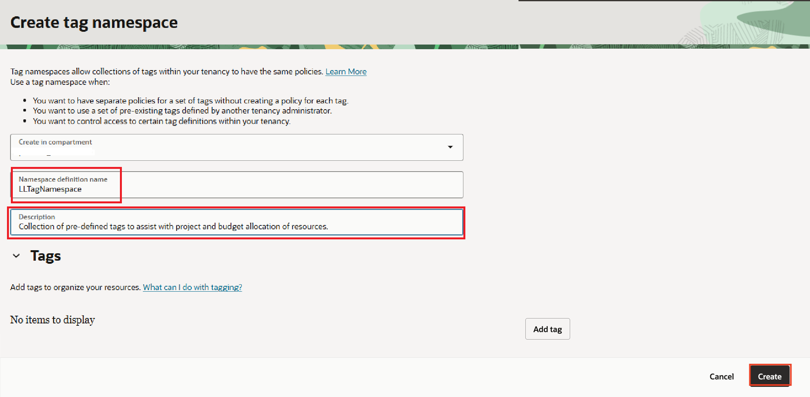

7. Verify the namespace appears in the list.

   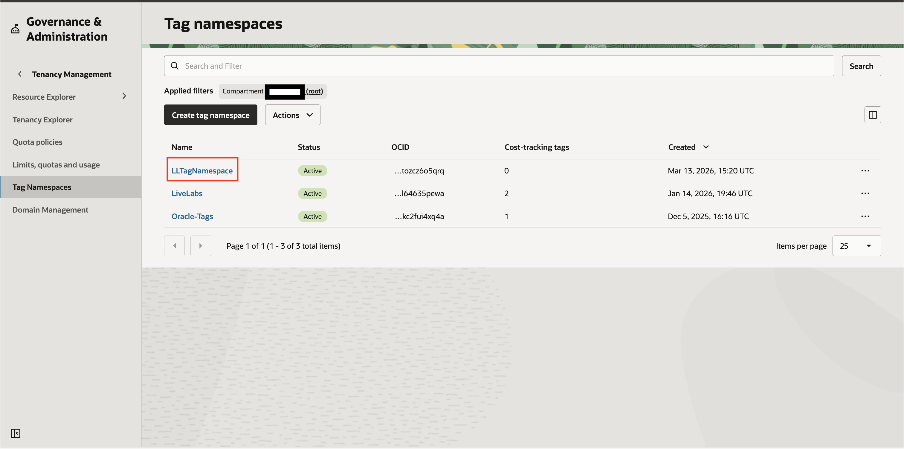

<details>
<summary>CLI Method (Optional)</summary>

 ```text
    <copy>
oci iam tag-namespace create \
--compartment-id <tenancy_ocid> \
--name LLTagNamespace \
--description "Namespace for LiveLab tagging exercises" \
--is-retired false
</copy>
```
Verify:
oci iam tag-namespace list --compartment-id <tenancy_ocid>

</details>

## Task 2: Create Tag Key Definitions

Now that you have created a tag namespace, you will create tag keys inside that namespace.

A tag namespace is like a folder.  
A tag key is the actual label that gets attached to resources.

In this task, you will create:

- A general tag key called **CostCenter**, which also serves as a *Cost Tracking* tag.
- A restricted tag key called **Environment**


OCI supports different types of tag validation:
- **No validation (flexible)** — Users can enter any value.
- **List of values (restricted)** — Users must select from predefined values.
Using list-based validation helps standardize tagging across teams.

## Task 2A: Create the CostCenter Tag

This tag will represent which department or business unit owns a resource. It will also be a cost-tracking tag which helps to enable precise billing allocation, budget monitoring, and granular cost analysis. More on this in Lab 3.

1. Navigate to **Governance & Administration → Tag Namespaces**.

2. Select the namespace you created earlier (`LLTagNamespace`).

   

3. Click **Create Tag Key Definition**.

   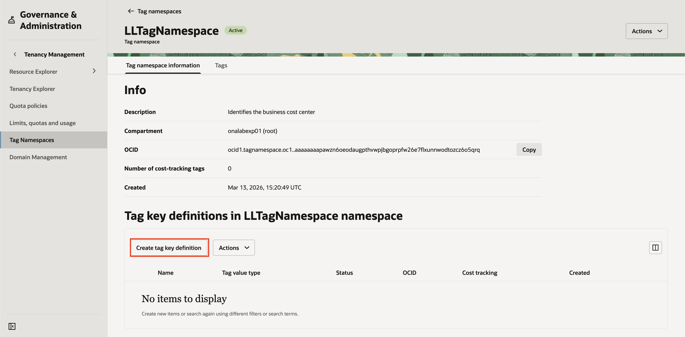

4. Enter the following:

      **Name:**
      ```text
      <copy>
      CostCenter
      </copy>
      ```
      **Description:**
      ```text
      <copy>
      Identifies the business cost center
      </copy>
      ```

   > **IMPORTANT** Be sure to click the **`Cost-tracking`** slide button.

5. Click **Create**.

   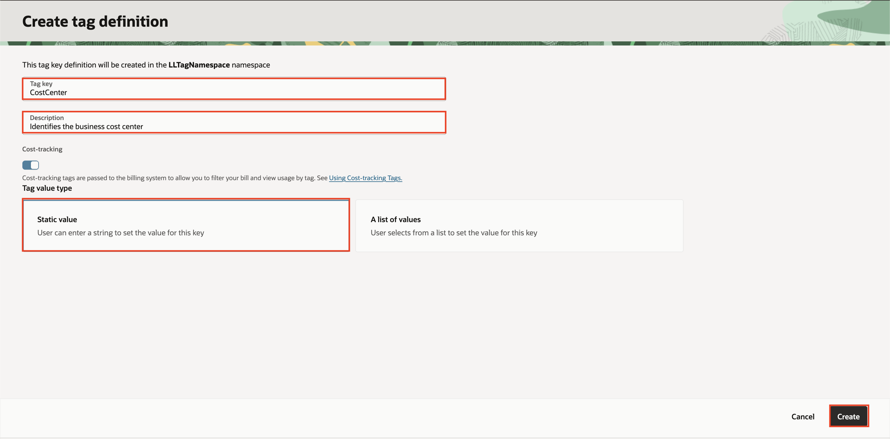

6. Validate the **CostCenter** Tag Key Definition appears in the list. 

   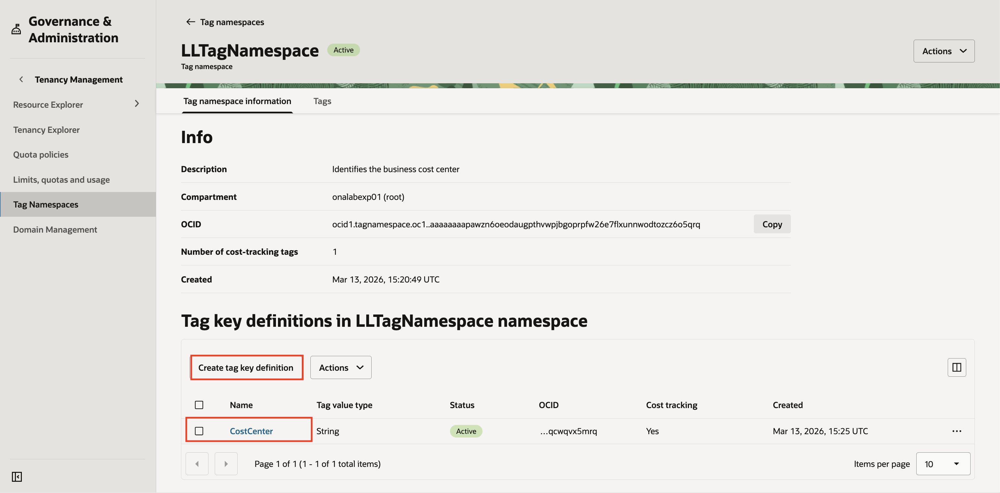

The CostCenter tag can accept any value when applied to a resource, such as:
- Finance
- IT
- Marketing
- 1001
This provides flexibility for business labeling.

<details>

<summary>CLI Method (Optional)</summary>

```text
<copy>
oci iam tag create \
--tag-namespace-id <tag_namespace_ocid> \
--name CostCenter \
--description "Identifies the business cost center" \
--is-cost-tracking true
</copy>
```
</details>

## Task 2B: Create the Environment Tag

This tag will identify the lifecycle stage of a resource.
To keep tagging consistent, you will restrict values to a predefined list.

1. Still inside the **`LLTagNamespace`** namespace, click **Create Tag Key Definition** once more.

   

2. Enter:

   **Name:** 
      ```text
      <copy>
      Environment
      </copy> 
      ```
   **Description:**
      ```text
      <copy>
      Identifies the environment of the resource
      </copy>
      ```

3. Under Tag Value Type, select **A list of values** and add the following:
      - Dev
      - Test
      - Prod

4. Make sure all the values are entered and click **Create**.

   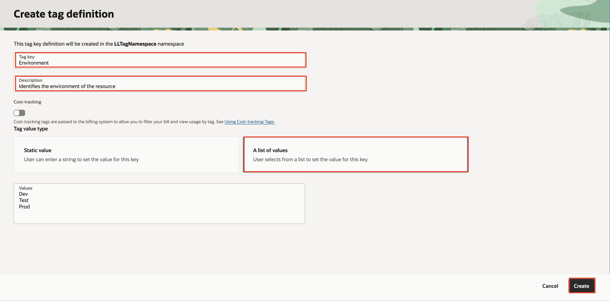

   When users apply this tag to a resource, they can only select Dev, Test and Prod. This ensures consistent tagging and supports future policy enforcement.

5. Verify your work.

   At the end of this task, confirm that both **CostCenter** and **Environment** appear under your namespace.

   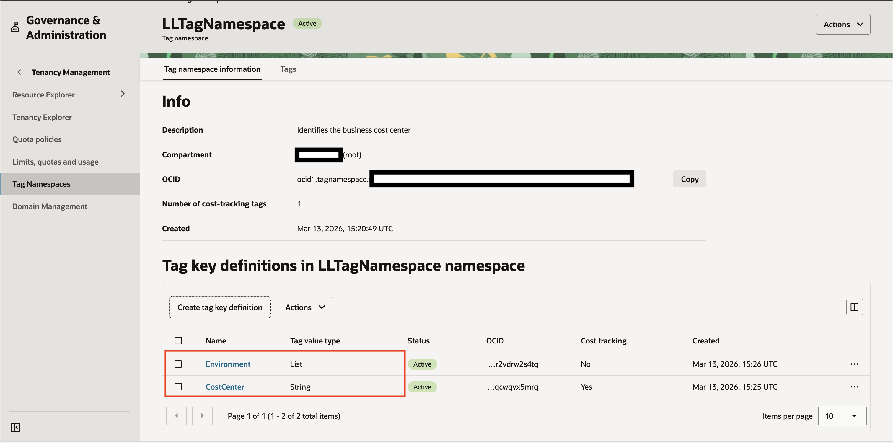

   Tag keys define the structure for how resources are labeled.
   In a later task, you will use these tag keys to automatically apply tags using Tag Defaults.

<details>
<summary>CLI Method (Optional)</summary>

```text
<copy>
oci iam tag create \
--tag-namespace-id <tag_namespace_ocid> \
--name Environment \
--description "Identifies the environment of the resource" \
--validator '{"validatorType":"ENUM","values":["Dev","Test","Prod"]}'
</copy>
```
</details>

## Task 3: Assign Tag Defaults to a Compartment
Now that you have created tag keys, you will configure a Tag Default.
A Tag Default automatically applies a defined tag to all new resources created inside a specific compartment. This helps ensure consistent tagging without requiring users to manually tag every resource.

**Without a Tag Default:**

Users must manually apply tags.
Tags might be forgotten or inconsistent.

**With a Tag Default:**

The tag is automatically added when a resource is created.
Governance becomes easier and more reliable.


1. Navigate to **Identity & Security → Compartments**.

   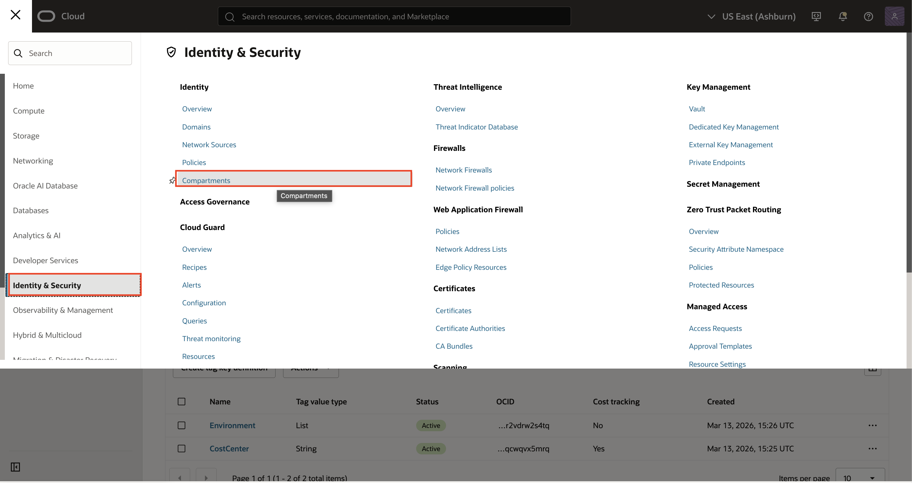

2. Select the compartment where you want the tag applied automatically. 
   
      > Selecting the root compartment will allow the tag to be applied automatically to **all** resources created in the tenancy. 

      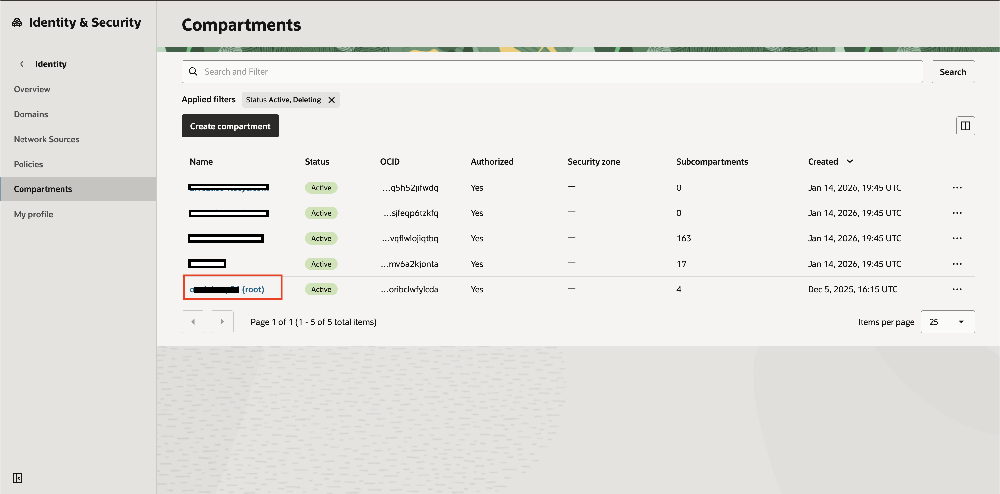

3. Navigate to **Tag Default**.

   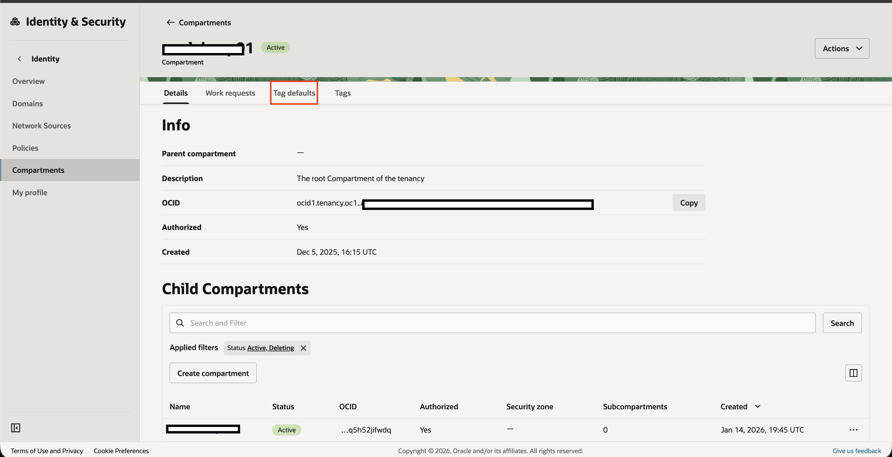

4. Click **Create Tag Default**.

   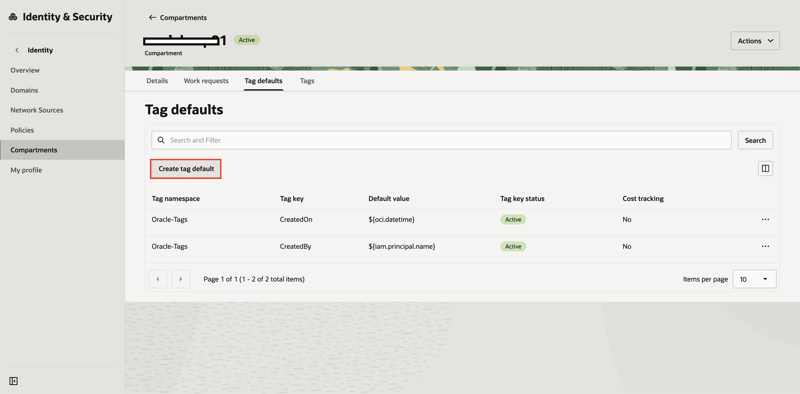

5. Choose:

      - Tag Namespace: `LLTagNamespace`
      - Tag Key: `Environment`
      - Default Value: `Prod`

6. Click **Create Tag Default**.

   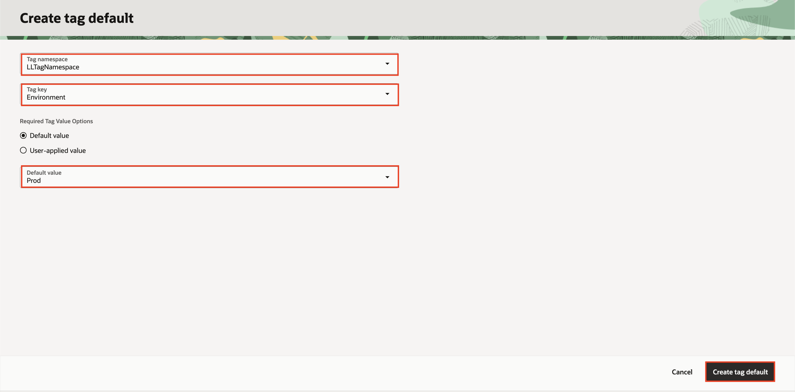

7. After assignment, confirm the Tag Default appears in the list for that compartment.

   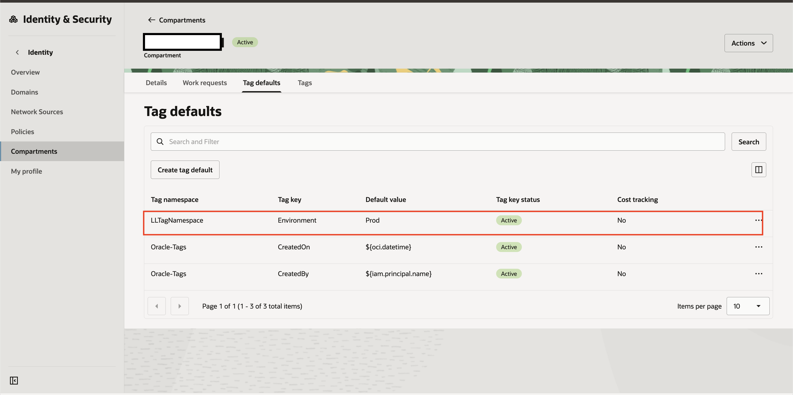

<details>
<summary>CLI Method (Optional)</summary>
To create a tag default, you need the OCID of the tag key definition (Tag Definition OCID).

1. Get your Object Storage namespace (you will use this later as well):
   ```text
   <copy>
   oci os ns get
   </copy>
   ```
2. List namespaces to find your namespace OCID:
   ```text
   <copy>
   oci iam tag-namespace list --compartment-id <tenancy_ocid>
   </copy>
   ```
3. List tags under your namespace to find the tag definition OCID for `Environment`:
   ```text
   <copy>
   oci iam tag list --tag-namespace-id <tag_namespace_ocid>
   </copy>
   ```
4. Create the tag default in the target compartment (example assigns `Prod`):

   ```text
   <copy>
   oci iam tag-default create \
   --compartment-id <target_compartment_ocid> \
   --tag-definition-id <environment_tag_definition_ocid> \
   --value Prod
   </copy>
   ```
5. Verify the tag default:
   ```text
   <copy>
   oci iam tag-default list --compartment-id <target_compartment_ocid>
   </copy>
   ```
</details>

## Task 4: Validate Tag Default Enforcement
Now you will confirm that your Tag Default is working as expected.
You will create a new bucket in the compartment where you assigned the tag default, and then verify that the defined tag was applied automatically.

1. Navigate to **Object Storage → Buckets**.

   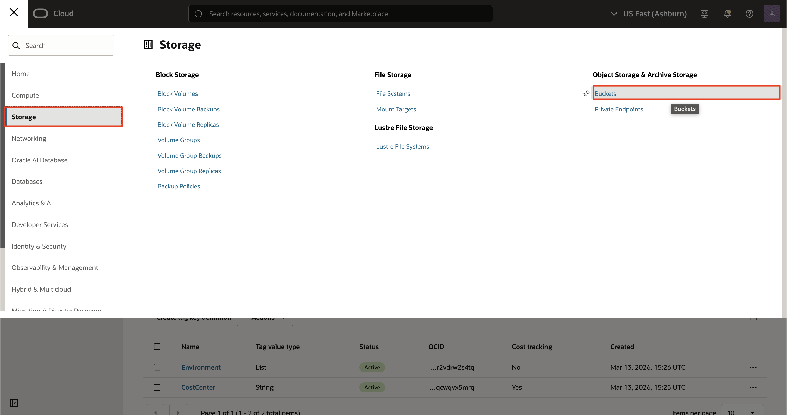

2. Select the same compartment where you applied the Tag Default and click **Create Bucket**

3. Enter a bucket name (for example: `tag-test-bucket`) and click **Create Bucket**

      ```text
      <copy>
      tag-test-bucket
      </copy>
      ```

   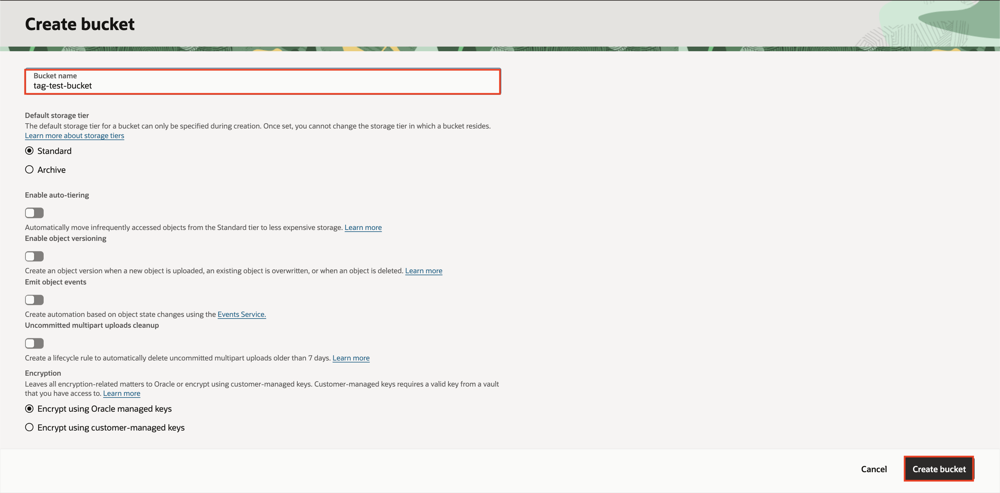

4. Open the bucket after it is created.

   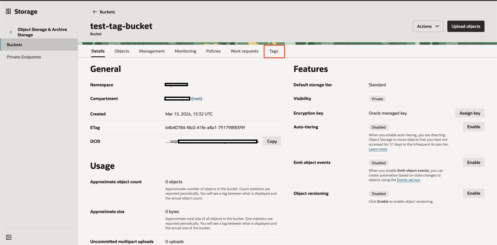

5. Scroll to the **Tags** section and confirm the tag is present.

   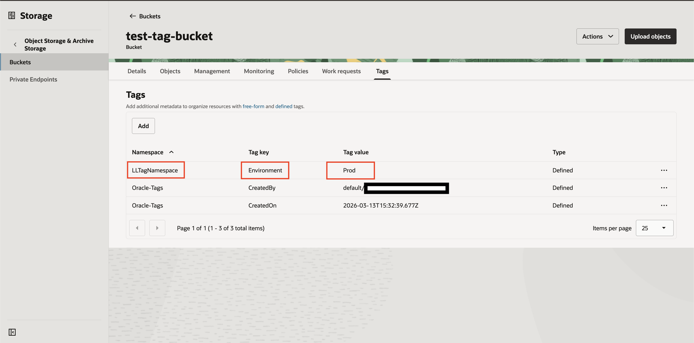

<details>
 <summary>CLI Method (Optional)</summary>
1. Get your Object Storage namespace (if you did not already):
```text
<copy>
oci os ns get
</copy>
```
2. Create a bucket in the compartment where the Tag Default is assigned:
```text
<copy>
oci os bucket create \
--compartment-id <target_compartment_ocid> \
--name tag-test-bucket-cli \
--namespace-name <object_storage_namespace>
</copy>
```
3. Verify the bucket details and confirm the defined tag appears:
```text
<copy>
oci os bucket get \
--bucket-name tag-test-bucket-cli \
--namespace-name <object_storage_namespace>
</copy>
```
In the output, look for the `defined-tags` section and confirm it includes something similar to:
- Namespace: `LLTagNamespace`
- Key: `Environment`
- Value: `Prod`

</details>

### Check Your Work
You should now have:
- A tag default assigned to your compartment
- A newly created bucket that automatically received the defined tag
- Confirmation in either the Console or CLI that tagging occurred automatically

## Summary
In this lab, you:
- Created a tag namespace
- Created static and list-based tag keys
- Reviewed tag templates
- Applied tag defaults to a compartment
- Validated automatic tag enforcement

Tag defaults improve governance, consistency, and cost management across OCI environments.

## Learn More

- [Managing tag defaults](https://docs.oracle.com/en-us/iaas/Content/Tagging/Tasks/managingtagdefaults.htm)
- [Using tag variables](https://docs.oracle.com/en-us/iaas/Content/Tagging/Tasks/usingtagvariables.htm)
- [Assemble effective tag set with CLI](https://docs.oracle.com/en-us/iaas/tools/oci-cli/latest/oci_cli_docs/cmdref/iam/tag-default/assemble-effective-tag-set.html)
- [Working with OCI Tag Defaults in Terraform](https://medium.com/oracledevs/working-with-oci-tag-defaults-in-terraform-d07608564eaf)


## Acknowledgements

- **Author** - Deion Locklear
- **Contributors** - Daniel Hart, Eli Schilling, Wynne Yang
- **Last Updated By/Date** - Published February, 2026