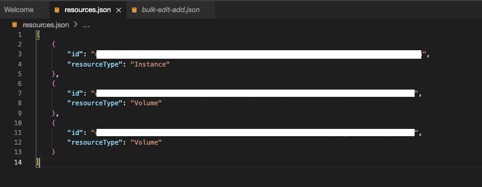
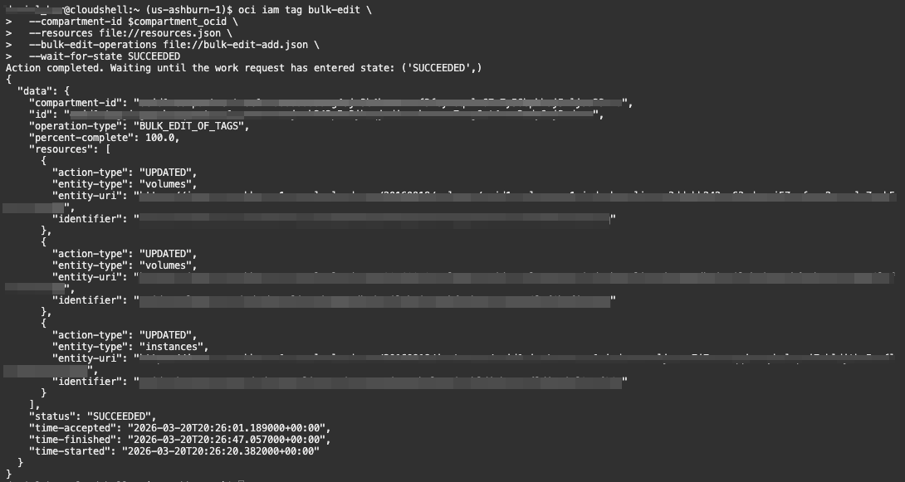

# Lab 2: Making Bulk Changes to Tagged Resources

## Introduction

In this lab you will provision a set of OCI resources (Compute instance, two Block Volumes, and an Object Storage bucket) and then use the OCI CLI to apply and modify defined tags on those resources in bulk. You will create one block volume attached to the compute instance and one unattached, plus an object storage bucket. After the resources are created, you will use the CLI to add defined tags and then alter them together.

**Estimated Time:** 30 minutes

### Objectives

In this lab, you will:

- Create resources
    - VCN
    - Compute Instance
    - 2 Block Volumes
    - Object Storage Bucket
- Use CLI to add / alter tags on the resources

### Prerequisites

This lab assumes you have:

- Completed the previous labs.
- Have access to Cloud Shell and Code editor

## Task 1: Create a VCN using the Wizard

Use the OCI UI to create a VCN.

### Console Steps

1. Open the OCI Console.

2. Select **Networking** and then **Virtual cloud networks** from the navigation menu.

  

3. Verify that you're in the correct compartment. Click the **Create VCN** button.

  

4. Enter **App-Network** for the name.

5. Enter **10.0.0.0/16** for the CIDR Blocks

6. Click **Create VCN**

    

7. Navigate to the **Subnets** tab and click **Create Subnet**

  

8. For name, enter **Public-Subnet**

9. Use **10.0.0.0/24** for the CIDR Block

10. Use the default route table for App-Network

11. Select Public Subnet

    

12. Select Default for DHCP Options and Security List. Then click **Create Subnet**

    

## Task 2: Generate SSH Keys

1. To start the Oracle Cloud shell, go to your Cloud console and click **Cloud Shell** at the top right of the page.

    

    

    

    >**Note:** If you get a *Policy Missing* error, make sure you have navigated first to the compartment assigned to you and then launched the cloud shell. Go to the *Need Help* lab -> *Cannot Access Cloud Shell?* to see how you can do that.

2.  Once the cloud shell has started, enter the following commands. Choose the key name you can remember. This will be the key name you will use to connect to any compute instances you create. Press Enter twice for no passphrase.

    ````text
    <copy>mkdir .ssh</copy>
    ````
    

    ````text
    <copy>
    cd .ssh
    ssh-keygen -b 2048 -t rsa -f <<sshkeyname>>
    </copy>
    ````
    *We recommend using the name **cloudshellkey** for your keyname but feel free to use the name of choice.*
    >**Note:** The angle brackets <<>> should not appear in your code.

    

3.  Examine the two files that you just created.

    ````
    <copy>ls</copy>
    ````

    

    >**Note:** In the output, there are two files, a *private key:* `cloudshellkey` and a *public key:* `cloudshellkey.pub`. Keep the private key safe and don't share its content with anyone. The public key will be needed for various activities and can be uploaded to certain systems as well as copied and pasted to facilitate secure communications in the cloud.

4. To list the contents of the public key, use the cat command:
     ```text
    <copy>cat <<sshkeyname>>.pub</copy>
     ```

    >**Note:** The angle brackets <<>> should not appear in your code.

    

5. Copy the contents of the public key and save it somewhere for later. When pasting the key into the compute instance in future labs, make sure that you remove any hard returns that may have been added when copying. *The .pub key should be one line.*

    

6. Save the path to your new ssh keys for use later.

    ```bash
    <copy>ssh_pub_key_path=$(ls ~/.ssh/*.pub | head -n 1)</copy>
    ```

## Task 3: Launch a Compute Instance

Use the OCI CLI to launch a compute instance. You must specify the compartment, subnet, image, and shape.

1. Collect the Compartment OCID.

    ```bash
    <copy>
    compartment_ocid=$(oci iam compartment list \
    --compartment-id-in-subtree true --all \
    --query 'data[?name == `your_compartment_name`].id | [0]' \
    --raw-output)
    </copy>
    ```

2. Pick an availability domain. 0=AD1, 1=AD2, 2=AD3

    ```bash
    <copy>
    select_ad=$(oci iam availability-domain list --query 'data[0].name' --raw-output)
    </copy>
    ```

3. Find the newest compatible Oracle Linux 9 image.

    ```bash
    <copy>
    image_ocid=$(oci compute image list --compartment-id $compartment_ocid \
    --operating-system "Oracle Linux" --operating-system-version "9" \
    --shape VM.Standard.E4.Flex --sort-by TIMECREATED --sort-order DESC \
    --query 'data[0].id' --raw-output)
    </copy>
    ```

4. Find public subnet in existing VCN

- We'll run the following two commands to retrieve network details required to launch the Compute instance. It's important to note that this assumes your VCN name is **`App-Network`**. If you created your own VCN or the facilitator has provided a different VCN name, be sure to update the command.

    ```bash
    <copy>
    ## retrieve VCN OCID
    vcn_ocid=$(oci network vcn list --compartment-id $compartment_ocid \
    --query 'data[?"display-name" == `App-Network`].id | [0]' --raw-output)

    ## retrieve the OCID for your public subnet
    subnet_ocid=$(oci network subnet list --compartment-id $compartment_ocid \
    --vcn-id $vcn_ocid --query 'data[?contains("display-name", `public subnet`)].id | [0]' \
    --raw-output)
    </copy>
    ```

5. Enter the following command to launch a Compute Instance.

    ```bash
    <copy>
    oci compute instance launch \
        --availability-domain $select_ad \
        --compartment-id $compartment_ocid \
        --image-id $image_ocid \
        --subnet-id $subnet_ocid \
        --display-name "LabCompute1" \
        --shape "VM.Standard.E3.Flex" \
        --shape-config '{"ocpus": 2, "memory_in_gbs": 32}' \
        --ssh-authorized-keys-file $ssh_pub_key_path \
        --assign-public-ip true \
        --wait-for-state RUNNING
    </copy>
    ```

6. Save the instance OCID from the command output for later tasks.

    ```bash
    <copy>
    instance_ocid=$(oci compute instance list --compartment-id $compartment_ocid \
    --query 'data[?"display-name" == `LabCompute1`].id | [0]' --raw-output)
    </copy>
    ```

## Task 4: Create Block Volumes and Object Storage Bucket

Create two block volumes using the OCI CLI. One will be attached to the compute instance.

1. Enter the following commands to create each block volume, and save their OCID.
    
    ```bash
    <copy>
    oci bv volume create \
      --compartment-id $compartment_ocid \
      --availability-domain $select_ad \
      --size-in-gbs 50 \
      --display-name LabVolume1
    </copy>
    ```

    ```bash
    <copy>
    bv_1_ocid=$(oci bv volume list --compartment-id $compartment_ocid \
      --query 'data[?"display-name" == `LabVolume1`].id | [0]' --raw-output)
    </copy>
    ```

    ```bash
    <copy>
    oci bv volume create \
      --compartment-id $compartment_ocid \
      --availability-domain $select_ad \
      --size-in-gbs 50 \
      --display-name LabVolume2
    </copy>
    ```

    ```bash
    <copy>
    bv_2_ocid=$(oci bv volume list --compartment-id $compartment_ocid \
    --query 'data[?"display-name" == `LabVolume2`].id | [0]' --raw-output)
    </copy>
    ```

2. Attach the first block volume to your compute instance.

    ```bash
    <copy>
    oci compute volume-attachment attach \
      --instance-id $instance_ocid \
      --volume-id $bv_1_ocid \
      --type paravirtualized
    </copy>
    ```

3. Ensure the volume attaches successfully before proceeding.

  

4. Create an object storage bucket.

    ```bash
    <copy>
    oci os bucket create \
      --compartment-id $compartment_ocid \
      --name lab-tagging-bucket
    
    bucket_ocid=$(oci os bucket get --bucket-name lab-tagging-bucket \
    --query 'data.id' --raw-output)
    </copy>
    ```
  

## Task 5: Prepare for Bulk Tagging

Create a `resources.json` file with all resource OCIDs and types.

1. Run the following command in the cloud shell to list your necessary OCIDs 

    ```bash
    <copy>
    printf "Instance OCID: %s\nBV 1 OCID: %s\nBV 2 OCID: %s \n" "$instance_ocid" "$bv_1_ocid" "$bv_2_ocid"
    </copy>
    ```

    

2. Open the Code Editor by clicking the **Developer Tools** button and then selecting **Code Editor**.

  

3. Click on the **New File** Button.

    

4. Name it `resources.json`

    

5. Copy the following JSON and replace the variables with the OCIDs from the previous CLI command.

    ```json
    <copy>
    [
      {
          "resourceId": "instance_ocid",
          "resourceType": "Instance"
      },
      {
          "resourceId": "bv_1_ocid",
          "resourceType": "Volume"
      },
      {
          "resourceId": "bv_2_ocid",
          "resourceType": "Volume"
      }
    ]
    </copy>
    ```

    

---

## Task 6: Set Initial Defined Tags and Apply Bulk Changes

1. Click on the **New File** button and name it `bulk-edit-add.json`

    

2. Paste the following JSON into the new file.
    ```json
    <copy>
    [
        {
          "definedTags": {
            "LLTagNameSpace": {
              "Environment": "Dev",
              "CostCenter": "8675309"
            }
          },
          "operationType": "ADD_OR_SET"
        }
    ]
    </copy>
    ```

    


3. To bulk edit the resources, run the following command in the **Cloud Shell**:

    ```bash
    <copy>
    oci iam tag bulk-edit \
      --compartment-id $compartment_ocid \
      --resources file://resources.json \
      --bulk-edit-operations file://bulk-edit-add.json \
      --wait-for-state SUCCEEDED
    </copy>
    ```
    

4. Check the defined tags on each resource with CLI commands such as:

    ```bash
    <copy>
    oci compute instance get --instance-id $instance_ocid --query "data.defined-tags"
    oci bv volume get --volume-id $bv_1_ocid --query "data.defined-tags"
    oci bv volume get --volume-id $bv_2_ocid --query "data.defined-tags"
    </copy>
    ```

5.  Confirm that all resources show the updated defined tag values.
    
6. To modify resources in bulk using tags, run the following command in the **Cloud Shell**:

    ```bash
    <copy>
    for ocid in $(oci bv volume list -c $compartment_ocid \
    --query 'data[?"defined-tags"."LLTagNameSpace"."Environment" == `Dev`].id' --raw-output | jq -r '.[]'); do
    echo "Resizing volume: $ocid"
    oci bv volume update --volume-id $ocid
    done
    </copy>
    ```

## Learn More

- [Bulk Editing tags on resoruces using the OCI CLI](https://www.ateam-oracle.com/bulk-editing-tags-on-resources-using-the-oci-cli)
- [OCI CLI bulk-edit reference](https://docs.oracle.com/en-us/iaas/tools/oci-cli/latest/oci_cli_docs/cmdref/iam/tag/bulk-edit.html)


## Acknowledgements

- **Author** - Daniel Hart
- **Contributors** - Deion Locklear, Eli Schilling, Wynne Yang
- **Last Updated By/Date** - Published February, 2026
