# Lab 4: Tag-Based Access Control

## Introduction

In this lab, you will use **Defined Tags within IAM policies** to control access to resources in Oracle Cloud Infrastructure (OCI). Tag-based access control allows administrators to grant or restrict permissions based on tag values instead of only using compartments. This provides more flexible and scalable governance.You will create a test group and user, write an IAM policy that evaluates the tag value, and confirm that users cannot delete resources tagged as **Production**.

**Estimated Time:** 25-30 minutes

### Objectives
In this lab, you will:
- Reuse the bucket created in Lab 1
- Create a test group and user
- Create a tag-based IAM policy
- Restrict deletion of Production resources
- Validate tag-based access control


### Prerequisites

This lab assumes you have:

- Completed previous tagging labs
- A defined tag namespace (`LLTagNamespace`)
- A defined tag key (`Environment`)
- A bucket created in Lab 1 with the tag default applied
- Administrative access to IAM
- Access to Cloud Shell or OCI CLI installed and configured (optional for CLI steps)

## Task 1: Navigate to your Bucket

In **Lab 1**, you created a bucket to confirm that Tag Defaults automatically applied tags to resources created in a compartment. You will reuse this resource to demonstrate how IAM policies evaluate tag values.

### Console Steps

1. Navigate to **Object Storage → Buckets**.

    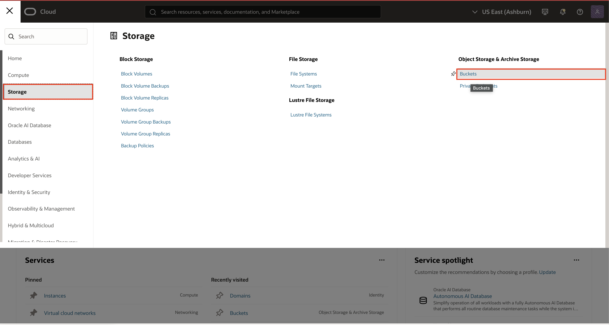

2. Locate the bucket created in Lab 1.

    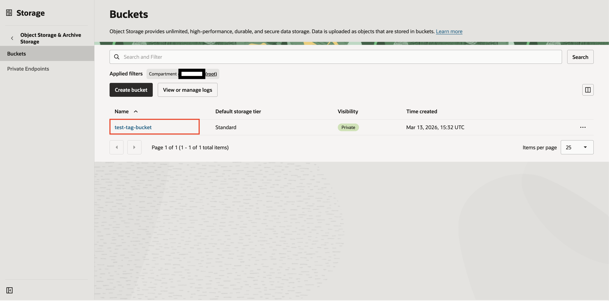

3. Open the bucket. 

4. Scroll to the **Tags** section. 

5. Confirm the following tag still exists

    LLTagNamespace.Environment = Prod

    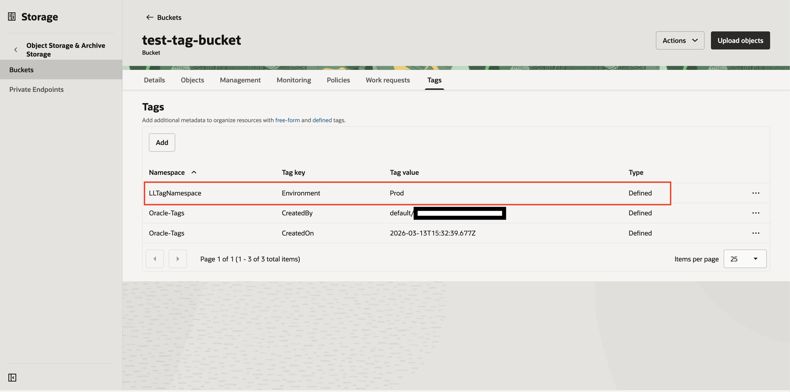


<details>
<summary>CLI Method (Optional)</summary>

1. Retrieve bucket details:

    ```bash
    <copy>
    oci os bucket get --bucket-name tag-test-bucket-cli --namespace-name <object_storage_namespace>
    </copy>
    ```

2. Or we could streamline the command since we're here to look at tags:

    ```bash
    <copy>
    oci os bucket get --bucket-name tag-test-bucket-cli --namespace-name <object_storage_namespace> --query 'data."defined-tags"'
    </copy>
    ```

    You'll notice in the output it only returns the contents of the defined tags JSON element:

    ```text
    {
        "LLTagNamespace": {
            "Environment": "Prod"
        }
    }
    ```

</details>


## Task 2: Create a Test Group and User
To validate tag-based access control, you will create a separate group and user.
This user will attempt to delete the tagged resource.
Console Steps

1. **Navigate to Identity & Security → Domains**.

    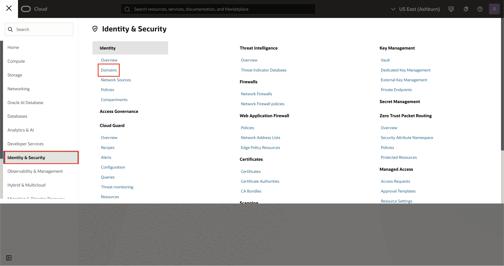

2. Click on your Domain

    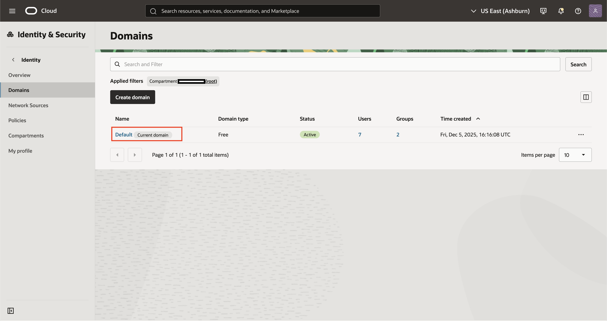

3. Navigate to User Mangement. 

    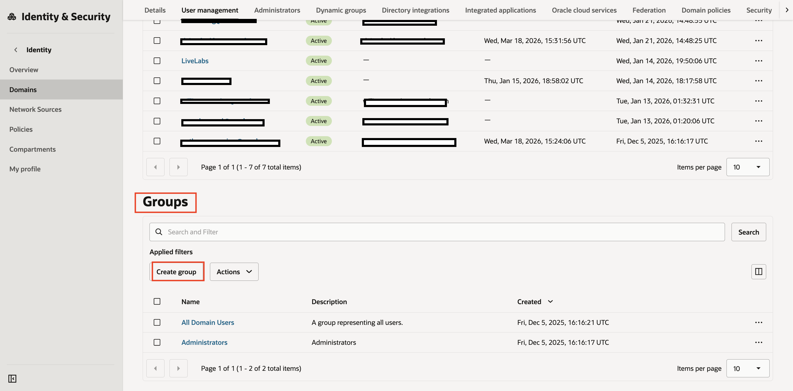

4. Scroll and click  **Create Group**.
5. Enter
    **Name:**
    ```text
    <copy>
    TagTestUsers
    </copy>
    ```

6. Click **Create**.

    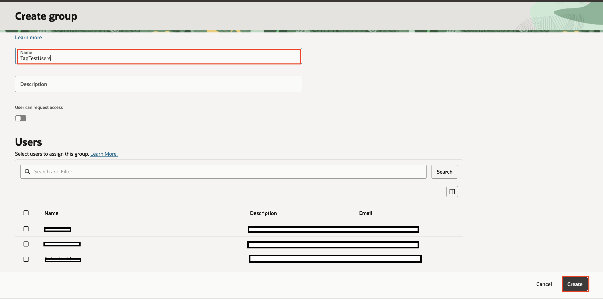

7. Navigate to **Users** and click **Create**.

    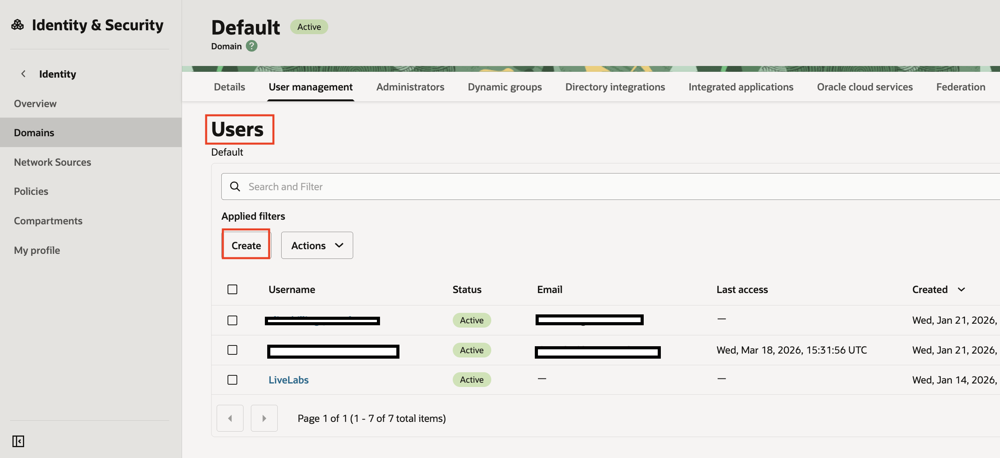

8. Enter **First Name**, **Last Name**, and an **Email** that is *not* currently assoicated with your cloud account.

7. Add the user to the **TagTestUsers** group.    

8. Click **Create**.

    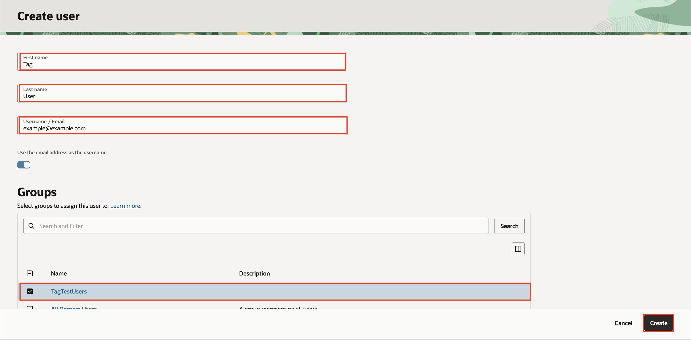

9. Confirm the user is in the group **TagTestUsers**.

    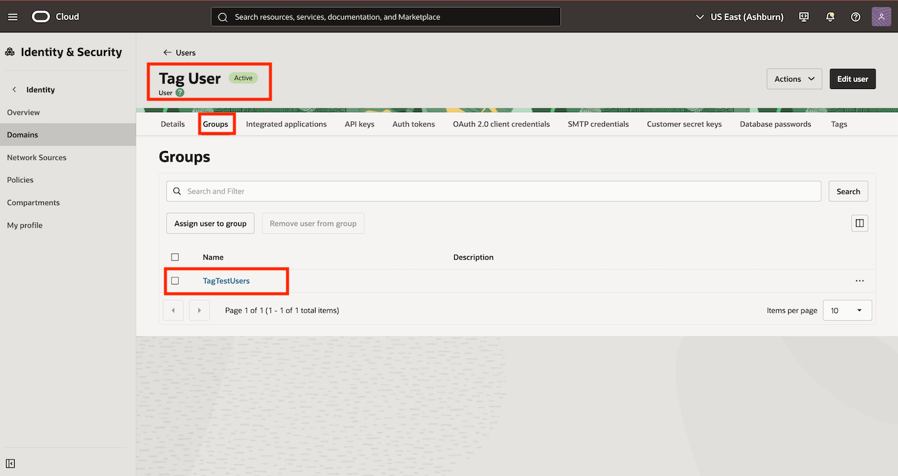
    

<details>
<summary>CLI Method (Optional)</summary>

1. Create the group

    ```bash
    <copy>
    oci iam group create \
    --compartment-id <tenancy_ocid> \
    --name TagTestUsers \
    --description "Tag testing group"
    </copy>
    ```

2. Create the user

    ```bash
    <copy>
    oci iam user create \
    --compartment-id <tenancy_ocid> \
    --name tagtestuser \
    --description "Tag policy test user"
    </copy>
    ```

3. Add user to group (make sure to retrieve group and user OCIDs from output of previous commands)

    ```bash
    <copy>
    oci iam group add-user \
    --group-id <group_ocid> \
    --user-id <user_ocid>
    </copy>
    ```

</details>

## Task 3: Create a Tag-Based Deny Policy
Now you will create a **deny policy** that blocks deletion of resources tagged as Prod.

### Console Steps

1. Navigate to **Identity & Security → Policies**.

    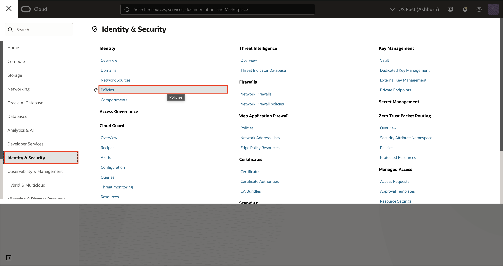

2. Click **Create Policy**.

    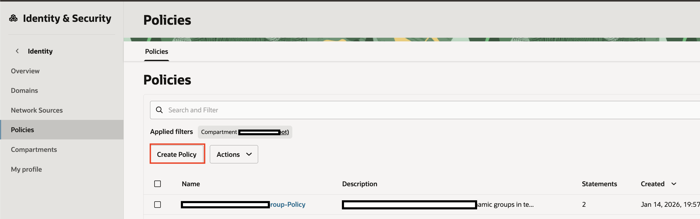

3. Enter **Name:**
    
     ```text
        <copy>
        TagDeleteRestrictionDenyPolicy
        </copy>
        ```

4. Enter **Description:**

    ```text
       <copy>
       Deny delete of Prod-tagged resources for TagTestUsers
       </copy>
    ```

5. In the **policy statement field**, enter:

    ```text
    <copy>
    Deny group TagTestUsers to manage buckets in tenancy where target.resource.tag.LLTagNamespace.Environment = 'Prod'
    </copy>
    ```
6. Click **Create**.

    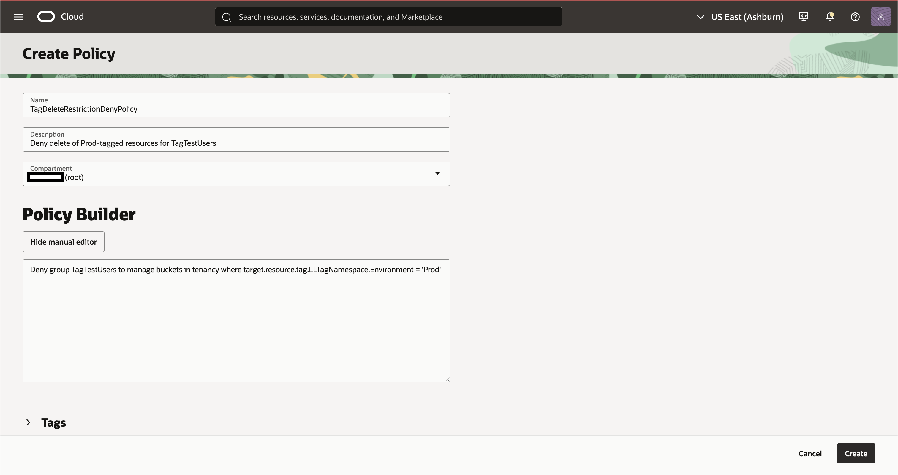

This policy means:

Members of **TagTestUsers** are explicitly denied bucket management actions (including delete) when the bucket tag is `LLTagNamespace.Environment = Prod`.

<details>
<summary>CLI Method (Optional)</summary>

```text
<copy>
oci iam policy create \
  --compartment-id <tenancy_ocid> \
  --name TagDeleteRestrictionDenyPolicy \
  --description "Deny delete of Prod-tagged resources for TagTestUsers" \
  --statements '[
    "Deny group TagTestUsers to manage buckets in tenancy where target.resource.tag.LLTagNamespace.Environment = '\''Prod'\''"
  ]'
</copy>
```
</details>

> **Important:** IAM deny policies are an opt-in tenancy feature and must be enabled before creating deny statements.

## Task 4: Validate Tag-Based Access Control
Now you will confirm that the policy is working.

### Console Validation

1. Sign out of the administrator account.

    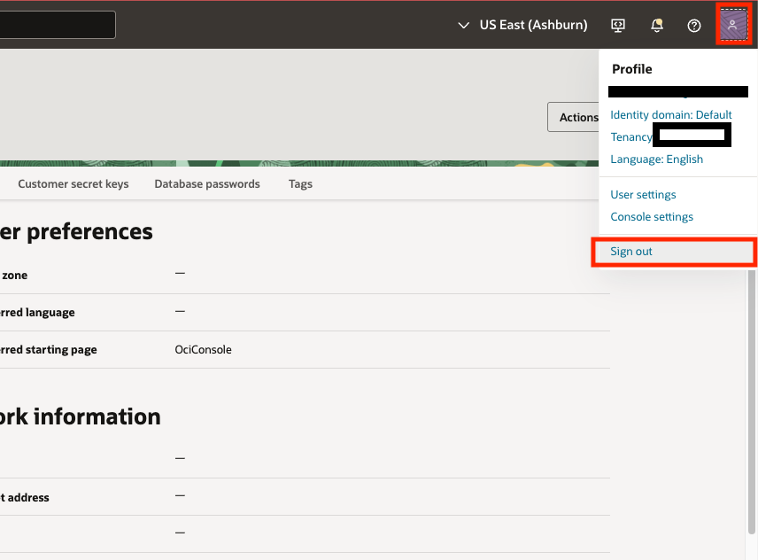

2. Sign in as **tagtestuser**.

    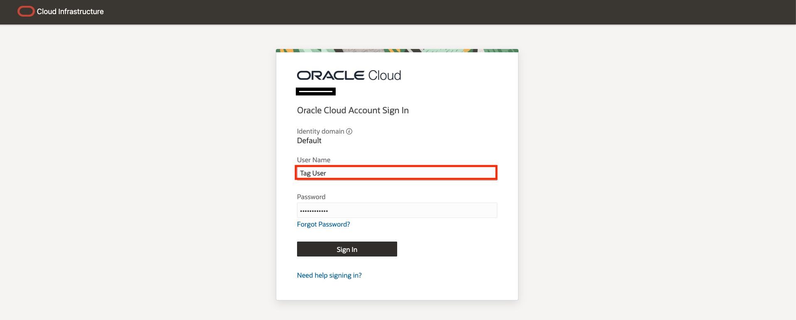

3. Navigate to **Object Storage → Buckets**.

    

4. Attempt to **Delete prod-bucket**.

    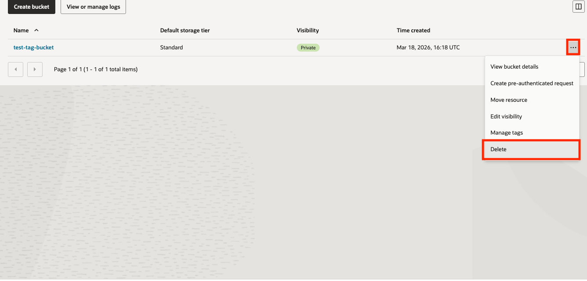

5. You should receive a permissions error.

    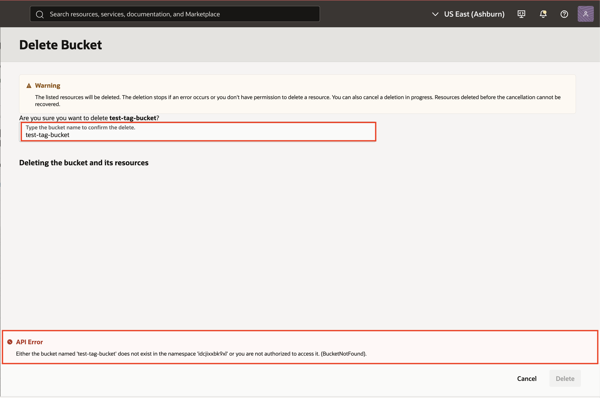


This happens because the bucket is tagged as Prod, and the deny policy explicitly blocks deletion (a manage-level action) for that tag value.

<details>
<summary>CLI Validation (Optional)</summary>

Using Cloud Shell (or configured CLI profile for tagtestuser):

    ```bash
    <copy>
    oci os bucket delete --bucket-name tag-test-bucket-cli --namespace-name <object_storage_namespace> --force
    </copy>
    ```
You should receive a "Not authorized" error.

</details>

## Task 5: (Optional Test)

1. Log back in as **Administrator**.
2. Change the bucket tag value from **Prod to Dev**.
3. Log back in as **tagtestuser**.
4. Attempt deletion again. This time, deletion should succeed. This demonstrates how tag values directly influence access control.

**Check Your Work**

You should now have:

- A bucket tagged as Production
- A test group and user
- A tag-based IAM policy created
- Verified that deletion is blocked for Production-tagged resources
- Observed how changing the tag changes access behavior

## Summary

In this lab, you:

- Applied a defined tag to a resource
- Created a test group and user
- Created a tag-based IAM policy
- Restricted deletion based on tag value
- Validated dynamic access control behavior
- Tag-based access control allows you to move beyond compartment-only permissions and implement flexible, metadata-driven security in OCI.

## Learn More

- [Using tags to manage access](https://docs.oracle.com/en-us/iaas/Content/Tagging/Tasks/managingaccesswithtags.htm)
- [Concepts guide: Tag-based access control](https://docs.oracle.com/en/engineered-systems/private-cloud-appliance/3.0-latest/concept/concept-tag-access.html#tag-access-example-taggedtargetcompt)
- [Improving the Aministrative ... Experience ...](https://blogs.oracle.com/cloud-infrastructure/improving-console-experience-with-tbac-in-oci)

## Acknowledgements

- **Author** - Deion Locklear
- **Contributors** - Daniel Hart, Eli Schilling, Wynne Yang
- **Last Updated By/Date** - Published February, 2025