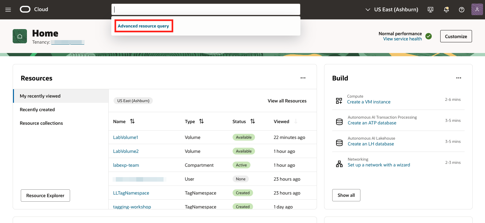
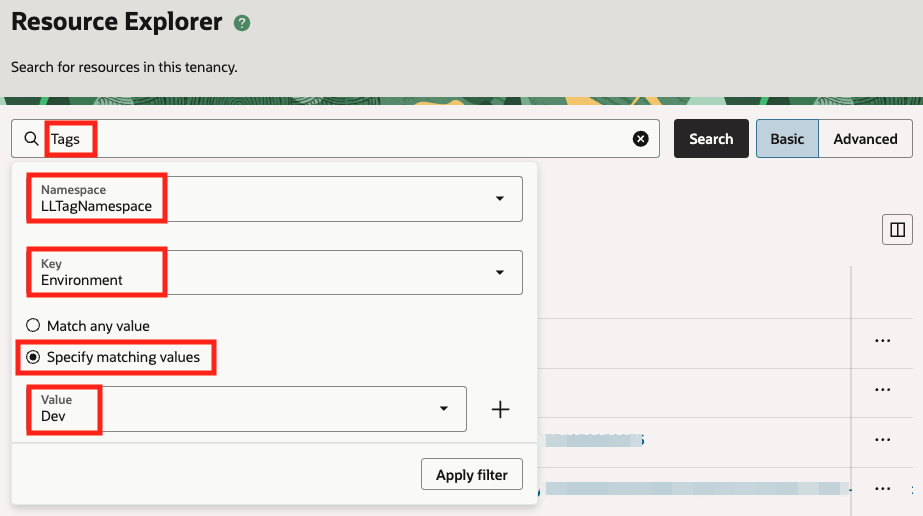
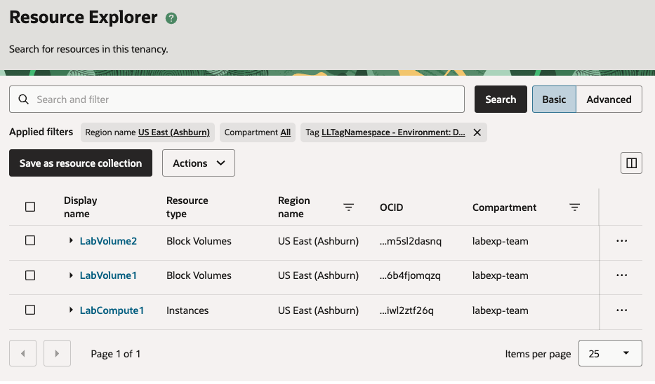
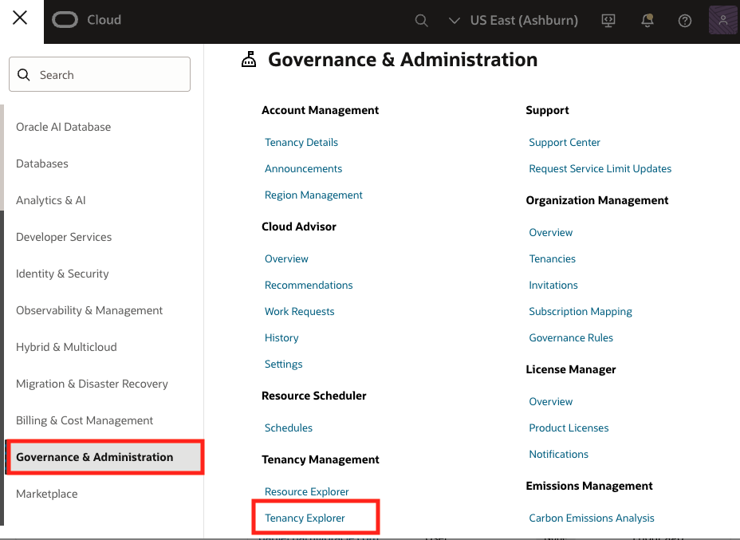
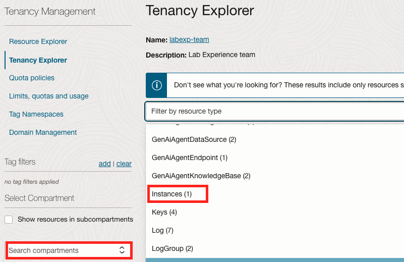
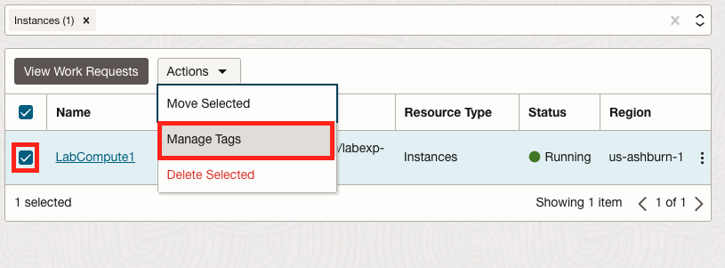
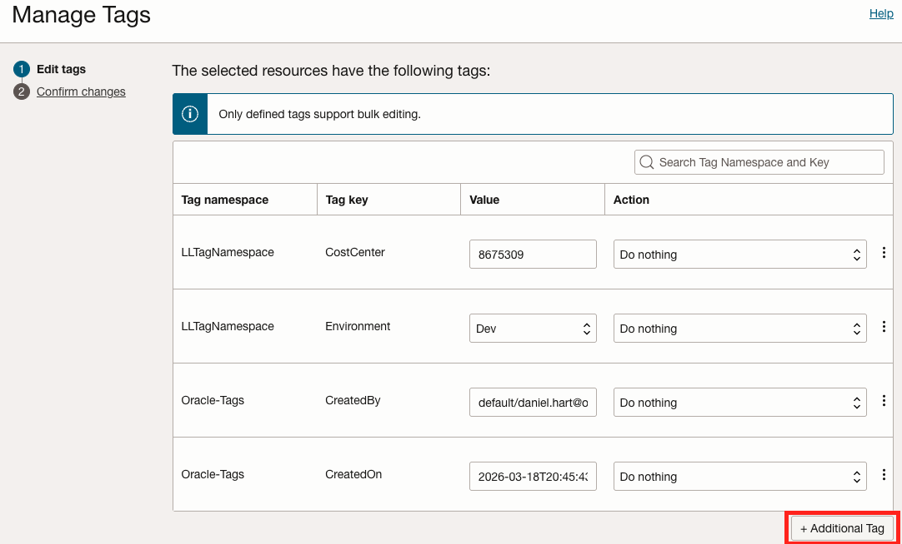
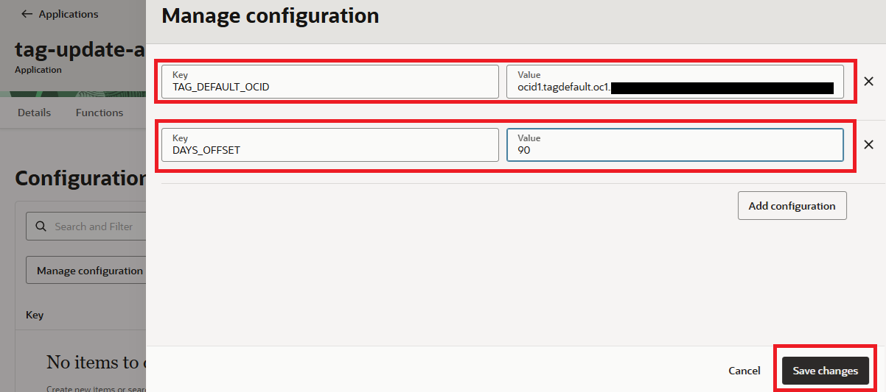

# Lab 5: Automated Resource Updates with Tags

## Introduction

In the previous labs, you created tags, applied defaults, performed bulk changes from the command line, and configured cost management features. These are all foundational capabilities. But in a tenancy with many users and resources, tags are only as useful as they are current. A tag that was accurate when a resource was created may become stale over time — an expiration date passes, a project code changes, or an owner transfers to a different team.

This lab focuses on discovering, updating, and automating tags to keep them accurate over time. You will work through three progressively more advanced approaches:

1. **Console-based discovery and bulk editing** — Use the OCI Console's search capabilities and Tenancy Explorer to find resources by tag and update tags across multiple resources at once.
2. **CLI-based search** — Use the OCI CLI in Cloud Shell to query resources by tag using the structured query language.
3. **Scheduled automation with OCI Functions and Resource Scheduler** — Deploy a serverless function that automatically updates a tag default's value on a daily schedule, ensuring that every new resource inherits a current, accurate tag value without manual intervention.

The third approach is inspired by a common real-world scenario: managing resource expiration dates in shared environments. In tenancies where many users create resources for demos, proof-of-concept work, or development, an automatically maintained expiration tag makes it easy to identify stale resources and take action — whether that action is a reminder to the owner, a cost review, or automated cleanup (as you will see in Lab 6).

**Estimated Time:** 25 minutes

### Objectives

In this lab, you will:

- Use the OCI Console search and Tenancy Explorer to discover resources by tag and update tags in bulk.
- Use the OCI CLI structured search to query resources by defined tag, free-form tag, and lifecycle state.
- Deploy an OCI Function that programmatically updates a tag default value using the OCI Python SDK.
- Configure OCI Resource Scheduler to invoke the function on a daily schedule.
- Verify that newly created resources inherit the auto-updated tag default value.

### Prerequisites

This lab assumes you have:

- Completed the previous labs in this workshop (you should have a tag namespace, defined tags, and tag defaults already configured).
- Access to OCI Cloud Shell (available from the OCI Console toolbar) or a local terminal with the OCI CLI installed and configured.
- A Functions development environment and the Fn CLI configured (if you completed Lab 6 first, this is already in place; if not, Task 5 will guide you through setup).
- A Virtual Cloud Network (VCN) with at least one subnet in your workshop compartment.

## Task 1: Discover Resources by Tag in the OCI Console

Before you can update or manage tags, you need to find the resources that have (or are missing) specific tags. The OCI Console provides two tools for this: the **Search** bar for quick discovery, and **Tenancy Explorer** for browsing and bulk-editing tags across resources.

### Search for Resources by Tag

1. In the OCI Console, click the **Search** bar at the top of the page.

2. Click **Advanced Resource Search** (or navigate to **Governance & Administration > Resource Explorer**).

    

3. In the search interface, you can build a query to find resources by tag. Select the following:

    - **Resource Type:** Select `All` or a specific type (e.g., `Instance`).
    - **Tag Namespace:** Select your workshop tag namespace (e.g., `LLTagNameSpace`).
    - **Tag Key:** Select a key (e.g., `Environment`).
    - **Tag Value:** Enter or select a value (e.g., `Development`).

    

4. Click **Search**. The results show all resources matching your tag criteria, along with their compartment, lifecycle state, and creation time.

    

    > **Tip:** You can also search for resources that have a specific tag key with *any* value, which is useful for verifying tag coverage — if a resource does not appear in the results, it may be missing the tag entirely.

5. Note the resource OCIDs and display names in the results. You will use these in the next steps.

### Bulk-Edit Tags with Tenancy Explorer

Tenancy Explorer allows you to select multiple resources and add, update, or remove defined tags in a single operation — all from the Console, with no CLI required.

1. Open the **Navigation Menu** and select **Governance & Administration**. Under **Tenancy Management**, select **Tenancy Explorer**.

    

2. Select your workshop compartment from the compartment picker. The Tenancy Explorer displays all resources in that compartment.

3. Use the **Filter by resource type** dropdown to narrow the list if needed (e.g., show only Compute instances).

    

4. Select the checkboxes next to two or more resources that you want to update.

5. From the **Actions** menu, select **Manage Tags**.

    

6. The **Manage Tags** panel opens with two sections:

    - The **top table** shows tags currently applied to the selected resources.
    - The **bottom table** lists the selected resources.

7. To **add a new tag** to all selected resources: Click **Additional Tag**, select a namespace, key, and value, and set the Action to **Apply tag**.

    

8. To **update an existing tag**: Find the tag in the list, change its value, and set the Action to **Apply tag**.

9. To **remove a tag**: Find the tag and set the Action to **Remove tag**.

10. Click **Next**, review the summary, and click **Submit**.

    OCI creates a work request to process the tag changes. You can monitor the status on the Work Request page that appears.

    > **Key Takeaway:** Tenancy Explorer is the easiest way to make ad-hoc tag updates across a handful of resources. For larger-scale changes or repeatable operations, the CLI approach in the next task is more efficient.

## Task 2: Search by Tags with the OCI CLI

The OCI CLI provides powerful tag management capabilities that can be scripted, repeated, and integrated into operational workflows. In this task, you will use Cloud Shell to search for resources by tag and perform bulk tag edits.

1. In the OCI Console, click the **Cloud Shell** icon (terminal icon) in the top toolbar. Cloud Shell opens with the OCI CLI pre-configured for your tenancy.

    > The `oci search resource structured-search` command uses the OCI Resource Query Service (RQS) to find resources across your tenancy using a structured query language.

2. Search for all resources with a specific defined tag key and value. Replace the namespace, key, and value with your own:

    ```bash
    <copy>
    oci search resource structured-search \
      --query-text "query all resources where (definedTags.namespace = 'LLTagNamespace' && definedTags.key = 'Environment' && definedTags.value = 'Dev')" \
      --query 'data.items[*].{Name:"display-name", Type:"resource-type", State:"lifecycle-state", OCID:identifier}' \
      --output table
    </copy>
    ```

    This returns a table of all resources tagged with `LLTagNamespace.Environment = Devel`, showing their name, resource type, lifecycle state, and OCID.

    ```text
    +-------------+-------------------------------------------------------------------------------------+-----------+----------+
    | Name        | OCID                                                                                | State     | Type     |
    +-------------+-------------------------------------------------------------------------------------+-----------+----------+
    | LabVolume2  | ocid1.volume.oc1.phx.abyhzzzzxxxzjkq   | AVAILABLE | Volume   |
    | LabVolume1  | ocid1.volume.oc1.phx.abyhzzzzzratybq   | AVAILABLE | Volume   |
    | LabCompute1 | ocid1.instance.oc1.phx.anabcwxyzarhz   | RUNNING   | Instance |
    +-------------+-------------------------------------------------------------------------------------+-----------+----------+
    ```

3. Search for all resources that have a specific tag key with *any* value (useful for auditing tag coverage):

    ```bash
    <copy>
    oci search resource structured-search \
      --query-text "query all resources where (definedTags.namespace = 'LLTagNamespace' && definedTags.key = 'CostCenter')" \
      --query 'data.items[*].{Name:"display-name", Type:"resource-type", State:"lifecycle-state"}' \
      --output table
    </copy>
    ```

4. Search for running compute instances that do *not* have a specific tag. This query finds running instances and you can compare the results against a tagged query to identify gaps:

    ```bash
    <copy>
    oci search resource structured-search \
      --query-text "query instance resources where lifecycleState = 'RUNNING'" \
      --query 'data.items[*].{Name:"display-name", OCID:identifier, Tags:"defined-tags"}' \
      --output json
    </copy>
    ```

    Review the JSON output. Any instance where the `defined-tags` field does not contain your expected namespace and key is missing the tag.

5. Search for resources by free-form tag (if your environment uses free-form tags):

    ```bash
    oci search resource structured-search \
      --query-text "query all resources where (freeformTags.key = 'CreatedBy' && freeformTags.value = 'workshop-user')" \
      --query 'data.items[*].{Name:"display-name", Type:"resource-type"}' \
      --output table
    ```

    > **Key Takeaway:** Recall that in Lab 2 you performed a bulk update of resources to add / alter tags. The combination of `structured-search` and `bulk-edit` gives you a scriptable, repeatable workflow: find resources by tag criteria, then update their tags in bulk. This pattern can be wrapped in a shell script and run on a schedule for ongoing maintenance.

## Task 3: Prep to Create an Auto-Updating Tag Default

In Tasks 1 and 2, you performed tag updates manually — either through the Console or the CLI. This works well for one-time corrections, but some tags need to be updated continuously. The most common example is an **expiration date tag**: a tag default that stamps every new resource with a date 90 days in the future, indicating when the resource should be reviewed or cleaned up.

The problem is that tag defaults are static — once you set the default value, it stays the same until someone changes it. If you set the default to `2026-06-01` today, every resource created next month will still get `2026-06-01`, even though the intended expiration is 90 days from the creation date, not from the date you configured the default.

The solution is to automatically update the tag default value every day using an OCI Function triggered by Resource Scheduler. Each day, the function recalculates the expiration date (today + 90 days) and updates the tag default. Any resource created that day inherits the correct, current expiration date.

### Create the Tag and Tag Default

1. If you do not already have an expiration date tag, create one. Navigate to **Governance & Administration > Tag Namespaces**, select your workshop namespace (e.g., `LLTagNamespace`), and click **Create Tag Key Definition**:

    - **Tag Key:** `ExpirationDate`
    - **Description:** `Date by which the resource should be reviewed or decommissioned`
    - **Type:** Leave as free-form (any string value).

2. Next, create a tag default so this tag is automatically applied to new resources. Navigate to **Identity & Security > Compartments**, select the compartment being usedfor this workshop, switch to the **Tag Defaults** tab, and click **Create Tag Default**:

    - **Compartment:** Select your workshop compartment.
    - **Tag Namespace:** Select your workshop namespace.
    - **Tag Key:** `ExpirationDate`
    - **Default Value:** Enter today's date plus 90 days in `YYYY-MM-DD` format (e.g., `2026-06-01`).
    - **Is Required:** Check this box so the tag is mandatory on all new resources in the compartment.

3. Click **Create**. Note the **Tag Default OCID** — you will need it when configuring the function.

### Create the Dynamic Group and IAM Policies

4. Navigate to **Identity & Security > Dynamic Groups** and click **Create Dynamic Group**:

    - **Name:** `FunctionsTagManagement`
    - **Description:** `Dynamic group for tag management function(s)`
    - **Matching Rule:** Enter the following rule, replacing `<compartment_ocid>` with the OCID of your workshop compartment:

    ```
    <copy>
    ALL {resource.type = 'fnfunc', resource.compartment.id = '<your_compartment_ocid>'}
    </copy>
    ```

5. Navigate to **Identity & Security > Policies** and click **Create Policy**:

    - **Name:** `TagManagementPolicy`
    - **Description:** `Allows Serverless functions to perform tag-related activities`
    - **Compartment:** Select your root compartment (tag defaults require tenancy-level permissions).

6. Add the following policy statements:

    ```
    <copy>
    Allow dynamic-group FunctionsTagManagement to manage tag-defaults in tenancy
    Allow dynamic-group FunctionsTagManagement to use tag-namespaces in tenancy
    Allow service cloudEvents to use functions-family in compartment <your_compartment_name>
    Allow any-user to manage functions-family in compartment <your_compartment_name> where all {request.principal.type='resourceschedule'}
    </copy>
    ```

    The first two statements allow the function to read and update tag defaults. The third allows Resource Scheduler to invoke the function.

    > **Note:** The Resource Scheduler policy uses `any-user` with a condition restricting it to the `resourceschedule` principal type. You can further narrow this with the specific scheduler OCID once created. See the Learn More section for details.

## Task 4: Create and Deploy the Tag Update Function

### Complete the pre-requisites

1. Before we can get started, you'll need a few things. From the command line in Cloud Shell:

    * Create an auth token; be sure to copy and paste the output to a text file just for good measure.

    ```bash
    <copy>
    ## Snag your user OCID - make sure to enter your actual user name
    user_ocid=$(oci iam user list --query "data[?name=='<your username here>'].id | [0]" --raw-output)

    ## Generate the auth token
    auth_token=$(oci iam auth-token create \
        --description "OCIR Login for Functions - Tagging HOL" \
        --user-id $user_ocid \
        --query "data.token" \
        --raw-output)

    echo $auth_token
    </copy>
    ```

    * Snag the tenancy namespace and tag default OCID from these commands

    ```bash
    <copy>
    tenancy_ns=$(oci os ns get --query "data" --raw-output)
    echo $tenancy_ns

    tag_default_ocid=$( oci iam tag-default list --compartment-id \
    $compartment_ocid --query 'data[?"tag-definition-name"==`ExpirationDate`].id | [0]' \
    --raw-output)
    echo $tag_default_ocid
    </copy>
    ```

    > NOTE: Your username for the next step is namespace/username

    * Verify login to OCI Container Registry (OCIR)

    ```bash
    <copy>
    # replace <region-key> with the 3-letter abbreviation for select region
    docker login <region-key>.ocir.io
    </copy>
    ```

    ```text
    ## EXAMPLE:
    docker login phx.ocir.io
    username: afoie1cs3t/first.last@domain.com
    password: ##nothing displayed when entering password
    Login Succeeded!
    ```

### Configure the Functions context

2. List, select, and update the required context

    * List context

    ```bash
    <copy>
    fn list context
    </copy>
    ```

    ```text
    # Output should look something like:
    CURRENT NAME            PROVIDER        API URL                                 REGISTRY
    *       default         oracle-cs
            us-phoenix-1    oracle-cs       https://functions.us-phoenix-1.oci.oraclecloud.com
    ```

    * Select context associated with your region and update

    ```bash
    <copy>
    fn use context <region full identifier>
    fn update context oracle.compartment-id $compartment_ocid
    fn update context registry <region 3-letter identifer>.ocir.io/$tenancy_ns/auto-tag-project
    </copy>
    ```

    ```text
    # Example output:
    zzz@cloudshell:tag-update (us-phoenix-1)$ fn use context us-phoenix-1

    Fn: Context us-phoenix-1 currently in use

    See 'fn <command> --help' for more information. Client version: 0.6.41
    zzz@cloudshell:tag-update (us-phoenix-1)$ fn update context oracle.compartment-id $compartment_ocid 
    Current context updated oracle.compartment-id with ocid1.compartment.oc1........
    zzz@cloudshell:tag-update (us-phoenix-1)$ fn update context registry phx.ocir.io/$tenancy_ns/auto-tag-project
    Current context updated registry with phx.ocir.io/izzzzzzzzzi/auto-tag-project
    ```

### Create the Function

2. In Cloud Shell or your local terminal, create a new function:

    ```bash
    <copy>
    fn init --runtime python tag-update
    cd tag-update
    </copy>
    ```

3. Replace the contents of `requirements.txt`:

    ```
    <copy>
    fdk>=0.1.105
    oci>=2.110.0
    </copy>
    ```

3. Replace the contents of `func.yaml`:

    ```yaml
    <copy>
    schema_version: 20180708
    name: tag-update
    version: 0.0.1
    runtime: python
    build_image: fnproject/python:3.11-dev
    run_image: fnproject/python:3.11
    entrypoint: /python/bin/fdk /function/func.py handler
    memory: 256
    timeout: 60
    </copy>
    ```

4. Replace the contents of `func.py` with the following code:

    ```python
    <copy>
    import io
    import json
    import datetime
    import logging

    import oci
    from fdk import response

    # Configure logging
    logger = logging.getLogger(__name__)
    logger.setLevel(logging.INFO)

    # Default number of days from today for the expiration date
    DEFAULT_DAYS_OFFSET = 90

    def get_signer():
        """Authenticate using Resource Principals."""
        try:
            signer = oci.auth.signers.get_resource_principals_signer()
            return signer
        except Exception as e:
            logger.error("Failed to get resource principals signer: %s", e)
            raise

    def get_config(ctx):
        """
        Read configuration from function/application config variables.

        Required:
            TAG_DEFAULT_OCID - The OCID of the tag default to update.

        Optional:
            DAYS_OFFSET - Number of days from today for the expiration date
                          (default: 90).
        """
        cfg = ctx.Config()
        tag_default_ocid = cfg.get("TAG_DEFAULT_OCID")

        if not tag_default_ocid:
            raise ValueError(
                "TAG_DEFAULT_OCID must be set as a configuration variable "
                "on the function or application."
            )

        try:
            days_offset = int(cfg.get("DAYS_OFFSET", DEFAULT_DAYS_OFFSET))
        except ValueError:
            logger.warning(
                "Invalid DAYS_OFFSET value; using default of %d",
                DEFAULT_DAYS_OFFSET
            )
            days_offset = DEFAULT_DAYS_OFFSET

        return tag_default_ocid, days_offset


    def calculate_expiration_date(days_offset):
        """Calculate the expiration date as today + the specified number of days."""
        expiration = datetime.date.today() + datetime.timedelta(days=days_offset)
        return expiration.strftime("%Y-%m-%d")


    def update_tag_default(identity_client, tag_default_ocid, new_value):
        """
        Update the tag default to the new value.

        Sets is_required=True so the tag is mandatory on all new resources
        in the compartment.
        """
        details = oci.identity.models.UpdateTagDefaultDetails(
            value=new_value,
            is_required=False
        )

        resp = identity_client.update_tag_default(tag_default_ocid, details)
        return resp.data


    def handler(ctx, data: io.BytesIO = None):
        """
        Main function handler.

        Calculates a new expiration date (today + DAYS_OFFSET) and updates
        the specified tag default to that value. Designed to be invoked daily
        by OCI Resource Scheduler.
        """
        try:
            tag_default_ocid, days_offset = get_config(ctx)
        except ValueError as e:
            logger.error(str(e))
            return response.Response(
                ctx,
                response_data=json.dumps({"error": str(e)}),
                headers={"Content-Type": "application/json"},
                status_code=400
            )

        signer = get_signer()
        identity_client = oci.identity.IdentityClient(config={}, signer=signer)

        new_value = calculate_expiration_date(days_offset)

        logger.info(
            "Updating tag default %s to value: %s",
            tag_default_ocid, new_value
        )

        try:
            updated = update_tag_default(
                identity_client, tag_default_ocid, new_value
            )
            result = {
                "message": "Tag default updated successfully.",
                "tag_default_ocid": tag_default_ocid,
                "new_value": new_value,
                "is_required": updated.is_required
            }
            logger.info("Update complete: %s", json.dumps(result))
        except oci.exceptions.ServiceError as e:
            result = {
                "error": f"Failed to update tag default: {e.message}",
                "tag_default_ocid": tag_default_ocid,
                "attempted_value": new_value
            }
            logger.error("Update failed: %s", e.message)
            return response.Response(
                ctx,
                response_data=json.dumps(result),
                headers={"Content-Type": "application/json"},
                status_code=500
            )

        return response.Response(
            ctx,
            response_data=json.dumps(result),
            headers={"Content-Type": "application/json"}
        )
    </copy>
    ```

### Deploy the Function

5. If you do not already have a Functions application, create one (if you completed Lab 6, you can reuse `tag-enforcement-app`). Otherwise, create a new one:

    ```bash
    </copy>
    fn create app tag-update-app \
        --annotation oracle.com/oci/subnetIds='["'$subnet_ocid'"]'
    </copy>
    ```

    Or create the application from the Console under **Developer Services > Functions > Create Application**.

6. Deploy the function:

    ```bash
    <copy>
    fn deploy --app tag-update-app
    </copy>
    ```

7. Set the required configuration variable. Navigate to the **Functions Application** in the Console, select the **Configuration** tab, and add:

    | Key | Value |
    |-----|-------|
    | `TAG_DEFAULT_OCID` | The OCID of the tag default you created in Task 3, step 2 |
    | `DAYS_OFFSET` | `90` (or your preferred number of days) |

    

    * Click **[Save chagnes]**

### Test the Function

8. Invoke the function manually to verify it works:

    ```bash
    <copy>
    fn invoke tag-update-app tag-update
    </copy>
    ```

    You should see a JSON response confirming the tag default was updated:

    ```json
    {
      "message": "Tag default updated successfully.",
      "tag_default_ocid": "ocid1.tagdefault.oc1..example",
      "new_value": "2026-06-02",
      "is_required": true
    }
    ```

9. Verify in the Console. Navigate to **Identity & Security > Compartments > <<Your Compartment>> > Tag Defaults**, find your `ExpirationDate` default, and confirm the value has been updated to today + 90 days.

10. Create a test resource (for example, a small compute instance) in your workshop compartment. After creation, inspect the resource's tags. The `ExpirationDate` tag should be present with the value your function just set.

## Task 5: Schedule the Function with Resource Scheduler

Now that the function works, you need it to run automatically every day so the tag default always reflects a current expiration date.

1. Open the **Navigation Menu** and navigate to **Governance & Administration > Resource Scheduler > Schedules**.

2. Click **Create Schedule** and enter the following:

    - **Name:** `daily-tag-default-update`
    - **Description:** `Updates the ExpirationDate tag default value daily`
    - **Action to be executed:** Select **Start**.

3. Click **Next** to proceed to resource selection.

4. Leave **Static** selected for the resource selection method. Use the search or browse interface to find your function (`tag-update` in the `tag-update-app` application). Check the box next to it.

5. Click **Next** to configure the schedule.

6. Set the recurrence:

    - **Frequency:** Daily
    - **Time:** Choose a time that works for your organization (e.g., 01:00 UTC, so the tag is updated before the start of the business day).

7. Set the **Start Date** to today and leave the **End Date** open (or set it to the end of your workshop if this is a temporary configuration).

8. Click **Next**, review the summary, and click **Create Schedule**.

    The schedule is now active. Every day at the configured time, Resource Scheduler will invoke the function, which will recalculate the expiration date and update the tag default.

    > **Note:** If you narrowed the Resource Scheduler IAM policy earlier using `any-user` without a specific scheduler OCID, you can now update the policy to include the scheduler's OCID for tighter security:
    >
    > ```
    > Allow any-user to manage functions-family in compartment <your_compartment> where all {request.principal.type='resourceschedule', request.principal.id='<scheduler_ocid>'}
    > ```

## Task 6: Verify the End-to-End Workflow

Let's confirm the entire workflow operates correctly.

1. **Check the current tag default value.** Navigate to **Identity & Security > Tag Defaults** and note the current value of the `ExpirationDate` default.

2. **Invoke the function manually** (or wait for the scheduled run):

    ```bash
    <copy>
    fn invoke tag-update-app tag-update
    </copy>
    ```

3. **Verify the tag default updated.** Refresh the Tag Defaults page in the Console. The value should now reflect today + 90 days (or whatever offset you configured).

4. **Create a new resource.** Launch a small compute instance in your workshop compartment. After it is created, navigate to its detail page and expand the **Tags** section. You should see the `ExpirationDate` tag with the current, auto-updated value.

5. **Search for resources by expiration date.** Use the CLI to find all resources with a specific expiration date:

    > **NOTE** Make sure to change the <<enter date + 90 days value here>> to a value that will match with the tags assigned.

    ```bash
    oci search resource structured-search \
      --query-text "query all resources where (definedTags.namespace = 'LLTagNamespace' && definedTags.key = 'ExpirationDate' && definedTags.value = '<<enter date + 90 days value here>>')" \
      --query 'data.items[*].{Name:"display-name", Type:"resource-type", OCID:identifier}' \
      --output table
    ```

    This query is how an operations team would identify resources approaching their expiration date — a list that can feed into a notification workflow, a cost review, or the automated enforcement you will configure in Lab 6.

## Task 7: Clean Up (Optional)

If you want to remove the resources created in this lab:

1. Delete the Resource Scheduler schedule (`daily-tag-default-update`).
2. Delete the function and application (or keep them if you are continuing to Lab 6).
3. Delete the IAM policy (`TagAutoUpdatePolicy`) and Dynamic Group (`FunctionsTagUpdate`).
4. Optionally, remove the `ExpirationDate` tag default (but keep the tag key definition if it is used by other labs).
5. Terminate any test compute instances you created.

You may now proceed to the next lab.

## Learn More

- [Managing Defined Tags for Multiple Resources (Tenancy Explorer)](https://docs.oracle.com/en-us/iaas/Content/General/Tasks/resourcetags-managing-defined-tags-multiple-resources.htm)
- [OCI CLI bulk-edit Reference](https://docs.oracle.com/en-us/iaas/tools/oci-cli/latest/oci_cli_docs/cmdref/iam/tag/bulk-edit.html)
- [OCI CLI Structured Search Reference](https://docs.oracle.com/en-us/iaas/tools/oci-cli/latest/oci_cli_docs/cmdref/search/resource/structured-search.html)
- [Search Language Syntax](https://docs.oracle.com/en-us/iaas/Content/Search/Concepts/querysyntax.htm)
- [Using Resource Scheduler and OCI Functions to Make a Tag Auto-Updating (A-Team Chronicles)](https://www.ateam-oracle.com/using-cron-to-make-a-tag-autoupdating)
- [Overview of Resource Scheduler](https://docs.oracle.com/en-us/iaas/Content/resource-scheduler/home.htm)
- [Overview of OCI Functions](https://docs.oracle.com/en-us/iaas/Content/Functions/Concepts/functionsoverview.htm)
- [Managing Tag Defaults](https://docs.oracle.com/en-us/iaas/Content/Tagging/Tasks/managingtagdefaults.htm)

## Acknowledgements

- **Author** - Daniel Hart
- **Contributors** - Eli Schilling, Deion Locklear, Wynne Yang
- **Last Updated By/Date** - Published February, 2026
